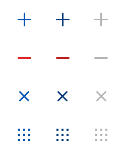

# Asset Library

Tizen 2.3 uses the [TizenSans family fonts](visual-style/typography-0.html). The TizenSans family consists of regular and medium weight fonts. You can download useful fonts from [here](https://developer.tizen.org/sites/default/files/documentation/fonts_tizensans_1.zip) and use them in your applications.

 

**Figure: TizenSans fonts**

## 2D Icons

The [2D icon style](visual-style/icons-0.md) in the Tizen 2.3 gives a generally round impression. The icons have 3 statuses (normal, pressed, and dim) and the color changes according to the status. You can download useful 2D icons from [here](https://developer.tizen.org/sites/default/files/documentation/tizen_2d_icons_2.3.zip) and use them in your applications.

 

**Figure: 2D icons**

## Controls (GUI Components)

Tizen 2.3 has various types of [controls](design-library/button.md) that can be used in an application. You can download the source files for the controls from [here](https://developer.tizen.org/sites/default/files/documentation/controls.zip) and use them in your applications.

 

**Figure: **Controls (GUI Components****)

