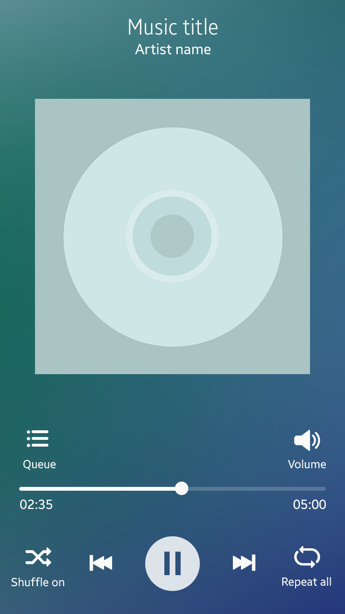
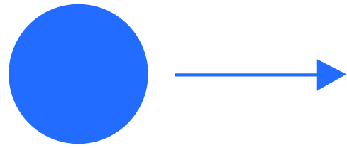
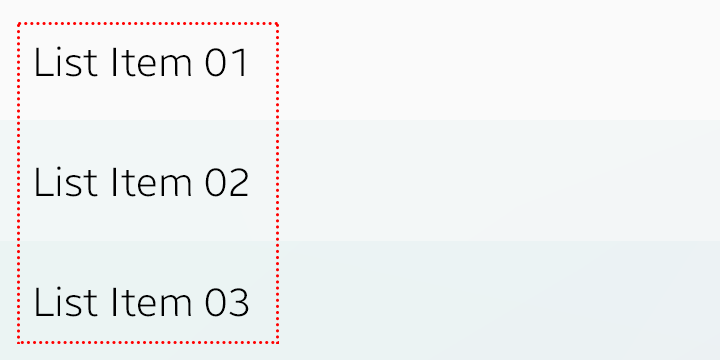
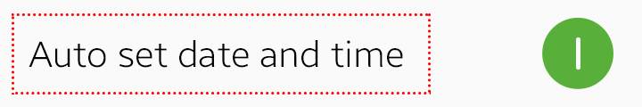

# Accessibility

Tizen provides users with a universal design, which presents the same level and quality of user experience regardless of the accessibility level of the individuals.

Accessibility levels of individuals vary. Users may have impaired sight, hearing, or other impairments. All user needs must be considered to create a universal design. Tizen provides a screen reader and larger font sizes to effectively convey information to users with different needs.

Developing an accessible app may not be easy. When you design an accessible app, there are many things that require your attention and consideration. However, your app design does not have to be limited by users with disabilities. Highly accessible apps are easy to use for everyone, after all.

By adding accessibility features to your app, you can ensure that it conforms to accessibility related laws, regulations, and standards. We are planning on increasing and fortifying support for accessibility features with Tizen. This will open an opportunity to help you develop more and more competitive apps.

## Tizen Screen Reader

 The screen reader feature was developed to assist users with poor sights. By reading text information to the users, it enables them to use apps without struggling with the small text information on the screen.

 

 Using this feature, you can design an app to provide a pleasant user experience to users with poor eyesight. It utilizes a TTS (text-to-speech) engine to transform the text and graphics on the screen into audible information. The screen reader recognizes the selected information or user interface, and provides audible feedback if a subsequent action is required.

 Because Tizen 2.4 fully supports the screen reader feature, you do not have to add additional graphical elements to your app to enable it.

 The following are guidelines for designing apps that support the screen reader.

## Guidelines for Designing Reader-Compatible Content

#### Provide Meaningful Labels for Graphical Elements
Tizen is capable of automatically transforming all the text information used with the UI components into audible information. However, to design an app that is fully compatible with the TTS feature, you should label the graphical elements in your app.

We recommend that you label the user interface components, such as graphical buttons, icons, and tabs, with intuitive and meaningful names. If a component is used to carry out three or more tasks, list each task by the sequence of execution.

<table>
<tr>
 <td>  </td>
 <td> 1. Favorite on / off  2. Queue  3. Volume  4. Shuffle on / off  5. Previous track : double-tap and hold to rewind  6. Play / Pause  7. Next track : double-tap and hold to fast-forward  8. Repeat on / off / once</td>
</tr>
</table>

*Informative labels for graphical elements*

Additional labeling is not required if you use the controls provided by the system in your app. Tizen provides labels, trait information, and optional attributes attached to the default user controls. For example, a radio button comes with a label text and a trait (selected/unselected), and a slider for screen brightness control comes with a label, a trait (%n of %n), and an optional attribute (flick up and down to adjust the position).

If you need to design your own controls for your app, refer to the examples of the system controls and label it with meaningful information to help users.

#### Provide a Predictable Flow

Design screens that allow users to easily predict the navigational flow. Provide a conventional and consistent layout that uses left-to-right and top-to-bottom swipe actions to ensure that your app to has a predictable navigational flow for easy focus transition.

The focus transition on the screen takes place in a linear manner. Therefore, it is always best to place the user controls in a linear manner as well to match the flow.

#### Understanding how the Screen Reader Works

Read and understand the basic interactions between an action and the screen reader before labeling the UI components for your app.

|Action          |Symbol            |Result when the Screen Reader is Enabled |
|----------------|------------------|-----------------------------------------|
|Tap             ||Selects and reads the item under your finger.|
|Double tap	     ||- Activates the selected item  - Activates edit mode (selects editable text)|
|Double tap and hold	||Allows users to drag an icon or view more options for selected items|
|Left swipe |  | Moves to previous / next items |
|Right swipe |  | Moves to previous / next items |
|2-finger tap |  | Pauses / resumes text-to-speech. |
|2-finger Left swipe |  | Changes pages / screens |
|2-finger Right swipe	|  | Changes pages / screens |

## Adjustable Font Size
Include font size options to increase accessibility. The following example shows how text elements are affected by changes in font sizes.

  
*Items affected by the font size setting : List*

  
*Items affected by the font size setting : Controls*

  
*Items affected by the font size setting : Radio buttons*

  
*Items affected by the font size setting : Description*
