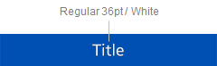
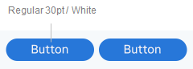
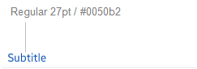
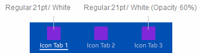

# Typography

To support its overarching [design principles](../design-principles.md) and unique visual style, Tizen 2.3 uses a dedicated font family named TizenSans. The TizenSans family consists of regular and medium weight fonts. You can download useful fonts from [here](https://developer.tizen.org/sites/default/files/documentation/fonts_tizensans_1.zip) and use them in your applications.

**Figure: TizenSans fonts**

## Font Styles

Too many font sizes make the UI complex, so Tizen 2.3 uses a limited set of font sizes that work well together, along with the layout grid. The basic set of font sizes is 21, 24, 27, 30, and 36.

 

**Figure: Tizen font styles**

