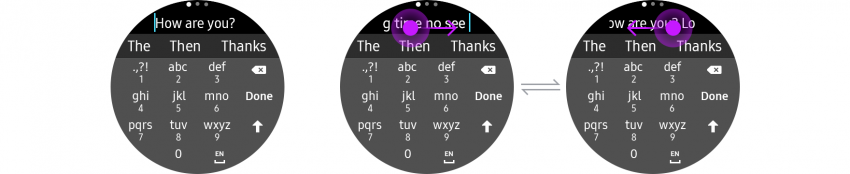

# Input

Users can input text with an input delegator or a keyboard. Input delegators are used for suggestions, voice input, emojis, and handwriting. A keyboard is used when suggestions aren’t available or privacy is needed, like when you need to enter a password.

  
*Input selectors or a keyboard can be provided for optimal wearable experience.*

## Input delegators

-   **App-provided suggestions**

    Users can select one of the suggestions provided by the app.

-   **Voice**

    Users can input words with their voice.

-   **Emoji**

    Users can select Unicode emoji.

-   **Handwriting**

    Users can use a finger to input on the Gear’s screen from the keyboard if the option is turned on in Settings.

## Keyboard

When the keyboard appears, the entry field is moved upward, so make sure that the location of the cursor is adjusted to remain visible on the screen. It’s also recommended to let longer phrases overflow out of the left side of the screen so that users can revisit them by swiping over the entry field without leaving the keyboard.

