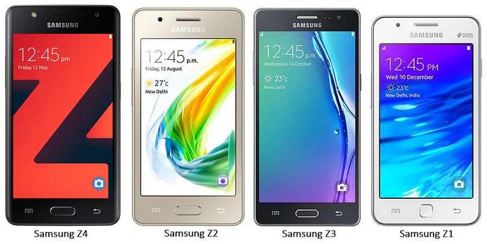

# Tizen Mobile

The Tizen mobile profile provides an effortless mobile experience with Tizen OS and a clutter-free, intuitive interface making it easy to understand and use. The profile comes preloaded with essential applications for the ease of new smart phone users. The device manufacture makes mobile devices more efficient; for example, the Ultra Data Saving mode in Samsung Z2 saves up to 40% in mobile data traffic by blocking unnecessary background applications from consuming data and by using a data compression technology, hence ensuring the simplest and most cost-efficient 4G experience.

## Developing Applications for Tizen Mobile

To develop applications for the mobile profile:

- [Creating Mobile Native Applications](https://developer.tizen.org/development/training/native-application/getting-started/creating-your-first-tizen-mobile-native-application)
- [Creating Web Native Applications](https://developer.tizen.org/development/training/web-application/getting-started/creating-your-first-tizen-mobile-web-application)
- [Native Application Samples](https://developer.tizen.org/development/sample/native)
- [Web Application Samples](https://developer.tizen.org/development/sample/web)

## Design Guidelines for Tizen Mobile

Tizen design principles suggest some clear guidelines that help you to design simple and easy-to-use applications for everyone:
- [Design Principles](https://developer.tizen.org/design/mobile/design-principles)

## Tizen Mobile Devices

Samsung Electronics expanded the Tizen ecosystem with the introduction of the Samsung Z4, a 4G smart phone that combines performance and essential features with a simplified user experience.

For the first time on the Z Series, the Samsung Z4 is equipped with a front and rear camera optimized for social media and a wide range of features focused on convenience and productivity, including quick and easy access to the most frequently used functions. Additionally, with 4G LTE, VoLTE, and VoWiFi (voice over Wi-Fi), the Samsung Z4 offers faster network connectivity.

For more information on developing a Samsung Z application, go to [SAMSUNG Z](http://developer.samsung.com/samsung-z).

**Figure: Mobile Samsung Z devices**

When developing applications for Samsung Z devices, the following device and SDK version matches are recommended:

- Samsung Z4 and Tizen 3.0
- Samsung Z2 and Tizen 2.4
- Samsung Z3 and Tizen 2.4
- Samsung Z1 and Tizen 2.3.1

###  Reference Mobile Device

TM1 is a reference device for the Tizen mobile profile. It is not for sale.
