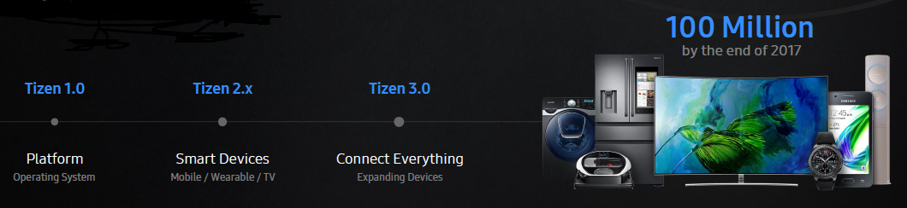
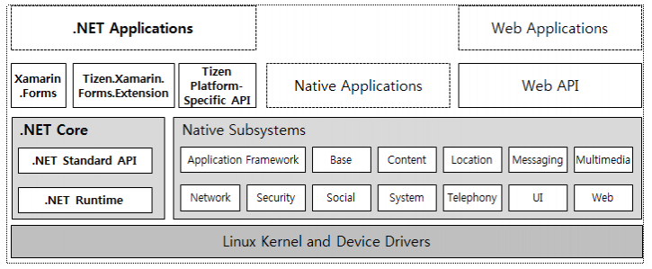
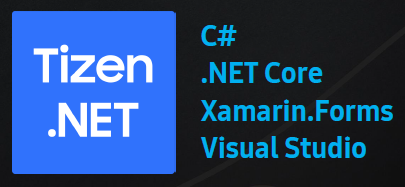
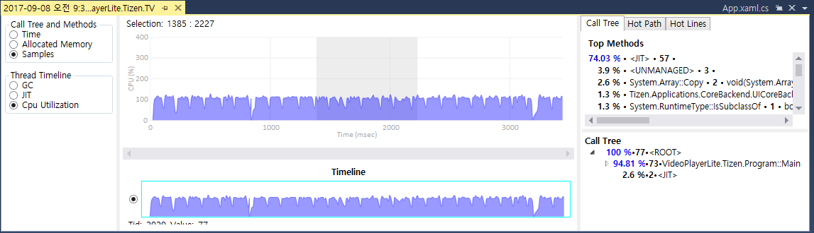
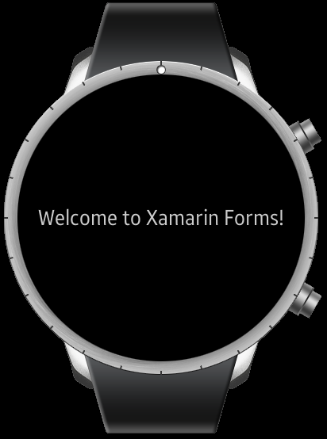
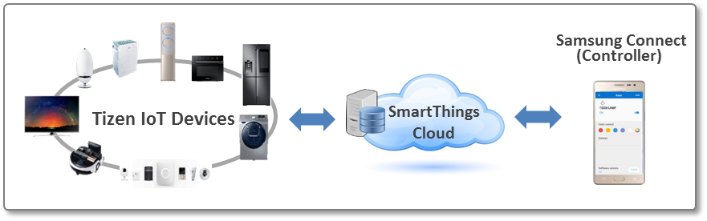

# Tizen 4.0 M2

Since the first release in 2012, Tizen has evolved adapting to the market requirements and technical advances. As smart devices are widespread in the market, Tizen is deployed to mobile phones, wearable devices, TVs, and home appliances. In the near future, lots of IoT (Internet of Things) services will pervade everyone's life. Tizen is moving forward as a convergence platform and Tizen 4.0 is another big step to the world of everything connected.

Figure. Evolution of Tizen

Tizen 4.0 M1 was a significant improvement of development environment: Tizen .NET architecture based on Microsoft's .NET Core and Xamarin.Forms, support of C# as an application language, and Visual Studio Tools for Tizen.

Figure. Tizen .NET architecture and groundwork

Tizen 4.0 M2 presents more advances in development environment and tools. Moreover, this version includes Tizen IoT preview 1  with a configurable SDK supporting headed mode and headless mode.

The key features are as follows:
* **Support of .NET Core 2**: Tizen .NET keeps pace with .NET Core that is widely used for cross-platform development. Tizen 4.0 M2 utilizes the benefits of [.NET Core 2](https://github.com/dotnet/core/blob/master/release-notes/2.0/2.0.0.md).  .NET Core 2 implements [.NET Standard 2.0](https://docs.microsoft.com/en-us/dotnet/api/?view=netstandard-2.0), in which code sharing is enhanced with increased number of available APIs. For more information of .NET Core 2 improvements, see [here](https://blogs.msdn.microsoft.com/dotnet/2017/08/14/announcing-net-core-2-0/).

* **Profiler**: Visual Studio Tools for Tizen is a set of useful tools for Tizen application development. In Tizen 4.0 M2, Profiler is added to help developers with easy debugging and advanced profiling.

* **Wearable emulator (beta version)**: It is convenient to run and check applications on emulators without connecting real target devices. In this version, emulating wearable devices is newly supported. Deployment of wearables is still at an early stage and the wearable emulator is expected to boost the application ecosystem.

* **Tizen IoT preview 1**: Tizen 4.0 M2 introduces Tizen IoT, a lightweight embedded Tizen OS for IoT devices. Tizen IoT can be configured for either "Tizen IoT Core (headless mode)" or "Tizen Common (headed mode)." Accordingly, Tizen Studio is configurable for both modes. For now, Tizen IoT supports two hardware platforms: Artick 530 and Raspberry Pi 3. For more information of Tizen IoT preview 1, see [here]().

For more details, see [Tizen 4.0 M2 release note]().
