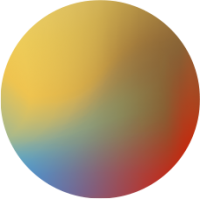
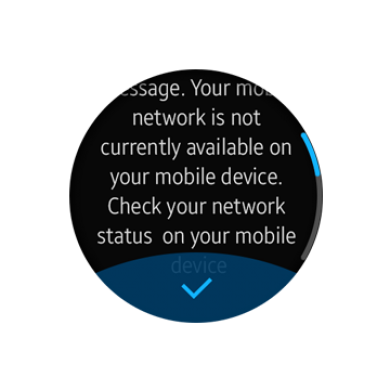
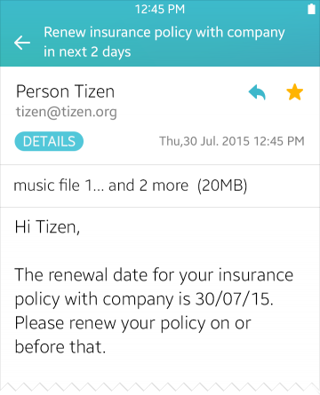
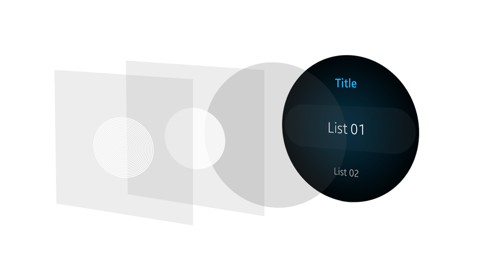

# Colors

Colors play an important role in creating designs for a rich visual experience. Carefully selected colors add rhythm and richness to the screen design and provide the entire system with visual consistency.

Tizen provides various color palettes to help you select colors to indicate different functions of on-screen objects.

This section provides information about the new default theme color since the Tizen SDK 2.4 and explains the system colors (functional colors) used to indicate different functions.

  
The new Tizen themes use gradients as the background.

Tizen features background gradients for both mobile and wearable devices by default. The system automatically transforms single-colored backgrounds into gradients by shifting hues and applying a slight shimmer.

Tizen mobile and wearable devices have different background schemes. While mobile devices use blue gradient schemes, wearable devices use darker background schemes based on the colors of the Aurora Borealis.

Refer to [Mobile Styles](../../mobile/styles.md) and [Wearable Styles](../../wearable/styles.md) for platform-specific style guidelines.

##### Recommendations

If you choose to design your own theme gradient, be careful about the gradient directions and range of colors. Avoid disorienting gradients and grayscale gradients to create a theme that is consistent with the overall Tizen visual experience.

  
  
*Disorienting gradient direction*

## Default System Colors

For basic action buttons, such as Go and Stop, Tizen 2.4 uses clear, distinct colors for focus and emphasis. Transparency may be applied to text colors to add subtle nuances.

The following are guidelines for choosing colors for your app design.

##### Avoid Button Colors Already in Use for the System Icons

In the Tizen SDK, basic action buttons, such as Go and Stop are assigned with distinctive colors to accent functions. If you design your app with button colors that are already in use with these icons, users may have hard times recognizing the system icons.

##### Choose Unique Colors for Your App

You can design your own theme, and apply it to your app to differentiate it from others. Just remember to use consistent color swatches that will enhance visual communication with users.

##### Keep Accessibility in Mind

It is important to remember that some users may have compromised vision, such as being near-sighted or color blind. Find combinations of colors that are easily distinguishable to these users. For example, if you have to use red and green colors together in one screen to indicate functions, adjust hue and contrast to make sure that these colors are distinguishable to users with red-green color blindness.

## Text and Background Color

On the Tizen platform, multiple layers are stacked together to produce the resulting screen colors. Since simpler colors are used in stacks, there are only a few rules to follow. These rules ensure that the combinations of colors are not unusual or unnatural.

##### Use Light-colored Text on the Default Background (Gradient)

On both the mobile and wearable devices, white text stands out on default theme colors, while black and gray text do not. Gray text against a background gradient generally results in poor readability.

   
Music player on a mobile device

##### Avoid Using Texts with Vivid Colors

Text with vivid colors, such as yellow, blue, and green may cause confusion. The following examples show that inconsistent use of vivid colors results in imbalances and distractions on the screen.

|  |  |
|:---:|:---:|  
| *Do* | *Don't* |

Color Structure

##### Multiple Color Layers

The main theme background (gradient) is placed at the bottom layer. In specific sections of the screen, multiple color layers are used to create visual depth. Text colors should be decided based on the resulting color of the stacked layers. On wearable devices, the center portion of the dark gradient layer decides the overall look and feel of the screen. App-specific colors or accent colors are placed over the center of the gradient layer. Light-colored text is recommended for wearable devices, because they use dark background colors by default.

  
Three color layers with different opacities over the background

      

The resulting screen

Tizen mobile devices use the same multilayered background structure. However, for mobile devices, the main theme background (gradient) is placed at the bottom layer.

  
Screen structure for Tizen mobile devices. Semi-transparent gradient stripes create subtle dividers for a list view.
