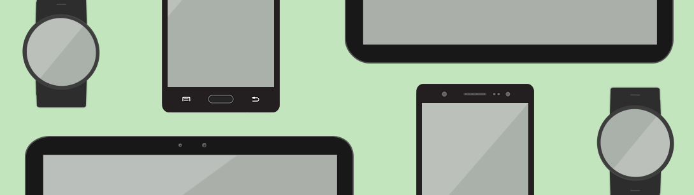

# Device Compatibility

Tizen supports various mobile and wearable devices with different display sizes. For this, detailed style guidelines are provided to help you create consistently designed apps across different hardware platforms.

#### From Small to Large, Increase Your Screen Real Estate

Consider the smaller screen layout when you start planning your design. Larger screens allow for more content. While it does not make initial planning easier, larger screen sizes do provide more options. Options are limited with smaller screens, so you must be more decisive when choosing which features you will include. Once you decide on the key features or the number of icons to display on smaller devices, you can always enlarge and rearrange content to use on larger screens, increase the number of the icons to display, or add more features to provide more information taking advantage of the increased screen size.

#### Go Smart with the Layout Design

A flexible design is required to properly display your content on different screens. Use design techniques to allow your design to fit any screen nicely. Also, design screen layouts based on the most restrictive device to come up with a highly compatible screen layout.

#### Consistent Design Language for All

Just because your design should fit on different screens does not mean that the design must differ from one screen to another. On the contrary, it is a good idea to keep the design consistent and uniform so that they look alike regardless of the screen size. Keep the same UI components, color, look, and feel of the overall design to let people know that it is the same app throughout devices.
