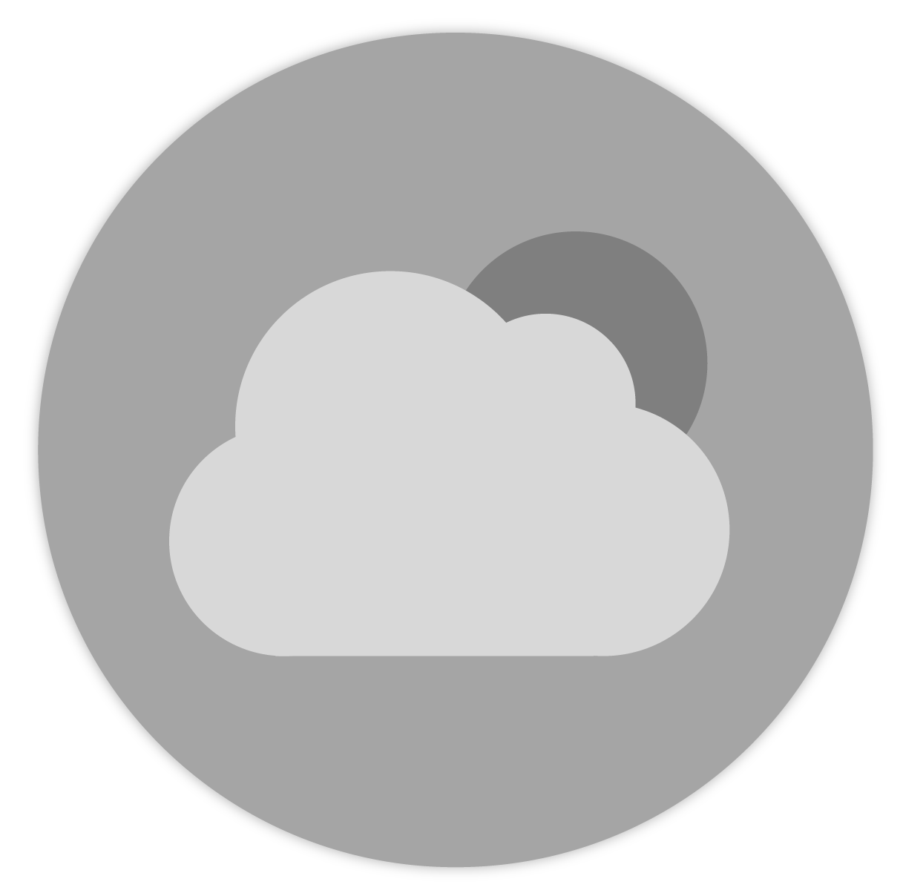
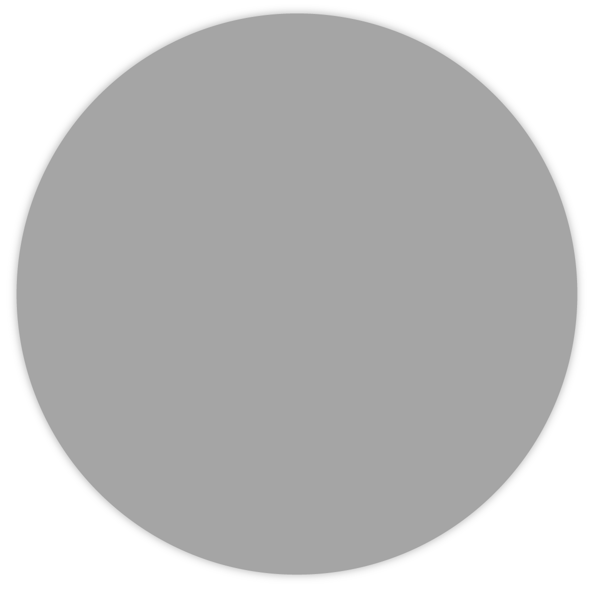
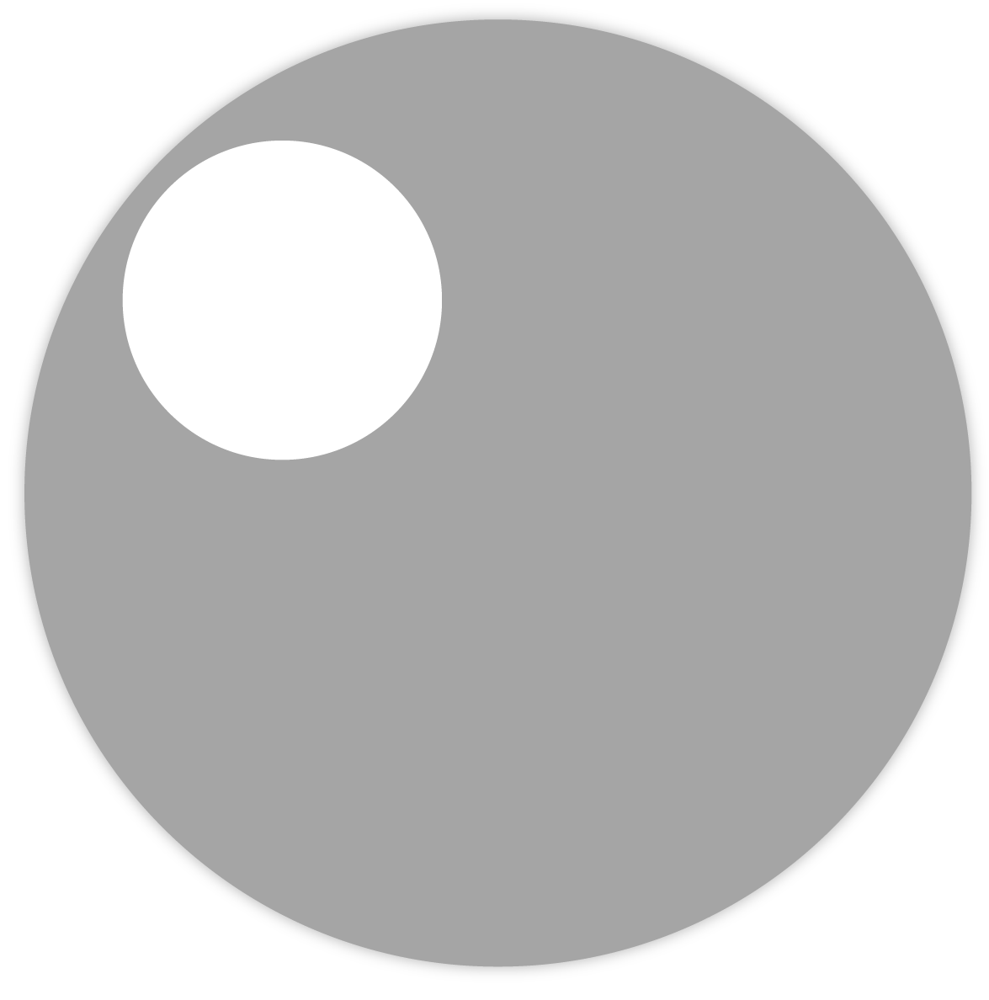
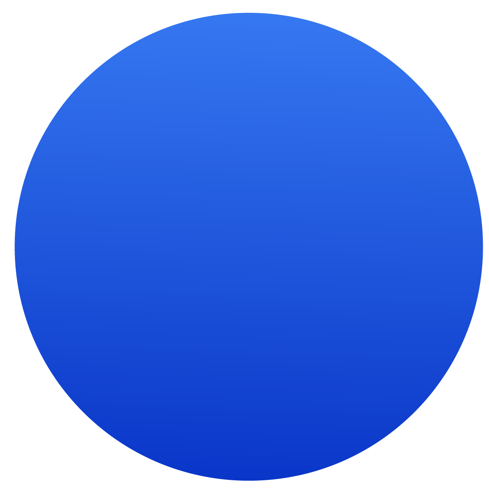
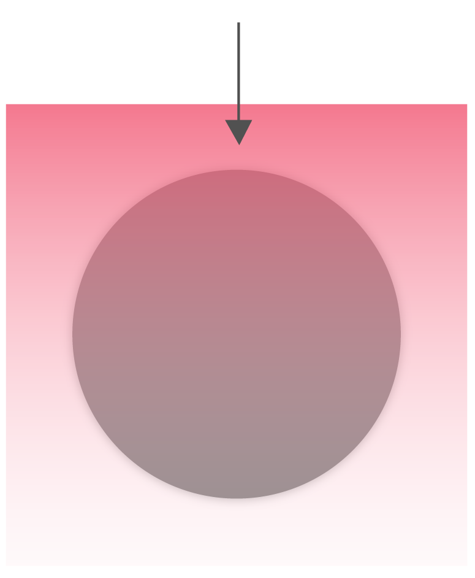

# Iconography

Tizen uses simple icon designs with subtle shadows. The following are guidelines for designing icons that instantly deliver information at a glance.

#### Use Icon Designs That Are Easy to Understand

When you design icons, ensure that they are easily understood without any additional description. Where applicable, use universal designs that are familiar to users. It's a good idea to perform a usability test on the icons after designing them.

#### Do Not Copy Real Life Objects, Iconize them

Use flat, simple designs to describe the main characteristics of an app. Design your icons to emphasize the shapes of objects so that they can be easily recognized, and match the style with the app icons that are displayed on the Home screen. Do not try to include realistic photos, detailed lines, or complicated shapes in your icons.

#### Prepare Differently Sized Icons for OS and Device Compatibility

Different Tizen platforms require different icon sizes. For example, mobile devices with a WVGA display and those with an HD display require icons in different sizes since Tizen SDK 2.4. Circular type wearable devices also require device-specific icon sizes.

|  Device  |   Resolution  | Icon asset size |
|---------|------------|-----------------|
|  Mobile  |   HD        |   118 x 118|
|  Mobile  |   WQHD      |   236 x 236|
|  Mobile   |  WVGA       |  81 x 81|
|  Wearable  | 360 x 360   | 152 x 152|

## App Icons

App icons are important because they visually represent your app on the Home screen. App icons must be attractive enough to draw a user's attention and they have to deliver meaningful information about your apps.

  

*Example of a Tizen app icon*

#### Shape It in a Circle

Tizen's system icons are displayed as circles. Although this requirement creates challenges in designing icons, the shape allows for a uniformity that ties different icons together for a consistent look and feel.

  

*Original circle concept, initial sketch*

#### Icon Colors and Background

Carefully choose the icon background color when designing an icon for your app. The background color greatly affects the visibility of your icon. Since the icon will be used to distinguish your app, icons should be designed for easy recognition. An icon with a carefully selected background color makes your icon design easy to notice, no matter where you place it.

   

*Your icons should be visible against any background*

#### Icon Patterns in Tizen

Icon always uses circle container. Avoid complicated shape.

|  |  |
|:---:|:---:|  
| *Do* | *Don't* |

Cicle container can not distorted or replaced to different shapes.

|  |  |
|:---:|:---:|  
| *Do* | *Don't* |

Place object on center. Do not place object around edge of container.

|  |  |
|:---:|:---:|  
| *Do* | *Don't* |

Tizen recommends soft gradient on container. Avoid solid color for background or disoriented gradient directions.

|  |  |
|:---:|:---:|  
| *Do* | *Don't* |

|  |  |
|:---:|:---:|  
| *Do* | *Don't* |

Lighting starts from top and end at the bottom

  

*Recommended lightening*

## Interactive Icons

Interactive icons allow for instant actions, or provide additional information about the currently displayed content. The same principles for designing app icons apply for the interactive icon design: use simple lines and shapes. In Tizen, there are two types of interactive icons.

#### Action Icons

On the screen, you can add an action bar and place 'Refresh', 'Back', 'Expand', or 'Close' action icons on it. Sometimes, text buttons, such as 'Cancel' and 'Done', may be added if applicable.

   
*An example of floating action button*

Here are the basic requirements of action icons:

-   Style : Use pictographic icons that are simple and bold. Choose an appropriate line thickness for the design.
-   Color : Design the icons with foreground colors brighter than background colors. Use darker icons over light-colored themes.
-   Button status : Design icons for normal, pressed, and dim states.

The link below takes you to download the Tizen Action Bar Icon Pack. You can find the action icon examples scaled for various screen sizes. This package includes icons designed in Adobe® Photoshop® format, so that you can customize them for your own designs.

> Download the Action Bar Icon Pack for [Mobile app design](https://developer.tizen.org/sites/default/files/documentation/action_bar_icon_pack.zip) and [Wearable](https://developer.tizen.org/sites/default/files/documentation/wearable_icon_pack.zip) (PNG and PSD files)

The Tizen SDK also includes default action icons for turning on or off certain features and making selections. Refer to [Checkbox Components](../../mobile/ui-components/user-input-components.md#check_) and [Radio Button](../../mobile/ui-components/user-input-components.md#radio_) for detailed information.

#### Informative Icons

Unlike action icons, informative icons are not touchable. They help users understand the content by providing self-explanatory visual information. In the examples below, the icons on the left of the call log categorize the type of call records as missed and received. On the other hand, the weather icon on the circular type wearable device in the example provides brief weather information at a glance.

   
*Call log icons categorize received, missed, and outgoing calls*

## Custom Icons

You can also design app icons to match your brand identity. When you do this, however, we recommend that you follow the styles provided in Tizen 2.4 2D to maintain visual consistency with the system icons. Carefully choose the colors, size, and location of the icon and make sure that the icon is visible at all times.

The following are the basic requirements for brand icons:

-   Size : Sizes may vary. Choose a size that provides a good balance with the content on the screen.
-   Style : Use simple pictographic icons that are easy to understand. Do not apply outline strokes or shadows.

|  |  |
 |:---:|:---:|  
 | *Do* | *Don't* |

-   Color : Design icons with colors that are easily noticeable. Use dark colors over light backgrounds and light colors over dark backgrounds to ensure optimal visibility.

|  |  |
|:---:|:---:|  
| *Do* | *Don't* |
