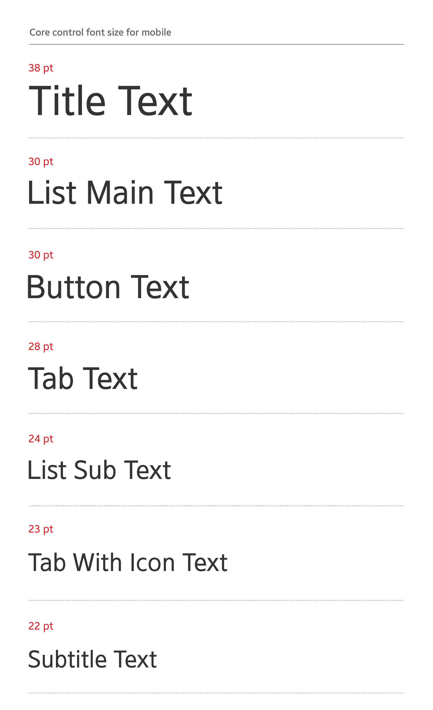

# Typography

## Breeze Sans

Choosing the right typeface is important because Tizen apps rely on content-driven designs. Typefaces that are easy to read can improve the usability of the design by helping users better understand the content.

Breeze Sans, the main typeface, is specifically designed for the Tizen UI since Tizen SDK 2.4. It provides excellent readability on all screen sizes, including the WVGA and HD resolutions.

Breeze Sans typeface comes in light, medium, regular, and condensed variants, and each variant has thin, light, regular, medium, bold, and Num-3L types. You can download Breeze Sans typeface from [Here](https://developer.tizen.org/sites/default/files/documentation/breeze_sans.zip).

    

*Breeze Sans*

Recommended font sizes for the mobile app designs

## Typeface-related Guidelines

These are the guidelines for choosing and applying the typefaces when you design a Tizen app:

#### Design High Contrast Screens for Better Legibility

Use light text on dark backgrounds and dark text on light backgrounds. If you choose a light color for the background, use bold and strong colored text in the foreground. Do not adjust the text opacity. It will decrease the contrast between the background and the text. On the other hand, use a dark background for light-colored text. Always test the background and text colors to make sure the combination results in good contrast before making a final decision.

Refer to [Colors](colors.md) for detailed information about background and text colors.

    

*Combination of text and background colors for high contrast*

#### Keep the Text Colors Consistent

Use text colors that stand out for important actions, and apply them consistently throughout the entire system. This will help users intuitively understand what the colors stand for.

     

*Blue action text on Wearable circular type*

#### Avoid Using Multiple Typefaces

Consistently use one font throughout your app. Displaying multiple typefaces in one system may result in confusion. If you need to design an interesting, yet consistent screen, use fonts with different styles or weights in the same font family instead.

For example, use bold type for the title and regular type for the body text. This allows for text-oriented designs that are consistent and distinctive.

|  |  |
|:---:|:---:|
| *Do* | *Don't* |

#### Avoid Drastic Changes in Font Size

Do not juxtapose text with varying sizes. Create a font size chart and refer to it when choosing the font sizes. Such practice helps you create more consistent and natural layout designs.

    

*Recommended font sizes for the mobile app designs*

#### Consider Providing Accessibility Options for Users with Disabilities

Tizen provides accessibility settings to allow users to customize display settings. By allowing users to adjust the font's color and size options, you can create an app that is universally accessible to all users.
