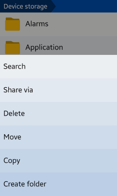
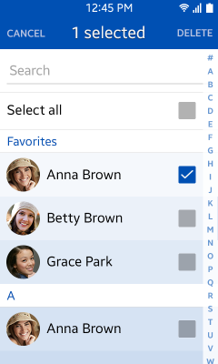

# Application Structure

The Tizen platform features a range of UI components. The purpose and functionality of your application determine the components and layout you select.

In this section, we use available Tizen UI components to demonstrate the most basic application structure.

> **NOTE**  
> For applications that require a special layout (such as camera, video player, and games), the following guidelines cannot be always applied.

For applications with a structure, display a list of items and only show details when an item is selected.

Generally, applications can have more than 2 layers and can be in a normal mode or edit mode based on the screen status, as shown in the following table.

**Table: Application levels and modes**

|                         | NORMAL MODE             | EDIT MODE                |
|-------------------------|-------------------------|--------------------------|
| TOP LEVEL               | Main view               | Edit mode of main view   |
| LOWER LEVEL             | Detail view             | Edit mode of detail view |

## Main View

Consider the following when designing the **Main** view:

### Start with an Overview

As the first screen of your application, the **Main** view plays a vital role in helping users find essential functions and understand the application structure. If the application structure has different categories, use tabs in the header.

**Figure: Main view of the Tizen Store application**  

### Enable Easy Content Management

Besides using or creating content items, users often need to manage content items. Provide the functions for managing contents in the **More** menu.\
The basic functions are as follows:

-   **Search**: Find an item. Provide the search feature in the **More** menu. For an application, which mainly uses the search feature in the item list, such as Contacts, you can offer the search field or an additional search button at the top of the screen.
-   **Share**: Share items at any time.
-   **Edit**: Provide functions that apply to multiple items (such as **Delete**, **Copy**, or **Move**) in the **More** menu.

**Figure: Content management using the More menu**  

## Detail View

Consider the following when designing the **Detail** view:

### Focus on Content

Display content elements, such as images or text, so that users recognize the content right away.

**Figure:** **Displaying content in the Detail view**  

### Execute Functions Easily

The **Detail** view displays various functions that users can execute in the current screen. You can place these function buttons in the **More** menu or in the body of your application screen. Do not display too many function buttons in the screen for Tizen Lite.

**Figure:** **Function buttons in the Detail view**  

### Enable Easy Navigation between Screens

In the Detail view, the hardware **Back** key on the device always takes the user back to the previous screen. Place the **Cancel** button on the screen to enable quitting the current task. Normally, the **Cancel** button is provided with a confirmation function, such as **Save**, **Done**, or **Send.**

**Video: Screen navigation (click to play)**  
<video controls width="240">
  <source src="media/applicationstructure_01.mp4" type=video/mp4>
</video>

## Edit Mode in the Main View

Consider the following when designing the edit mode in the **Main** view:

### Allow Users to Manage Multiple Items

In the edit mode in the **Main** view, the user can manage multiple items by selecting them with a checkbox. However, if the user wants to cancel a task, they should use the **Cancel** button or **Back** key.

When a user completes or cancels a task, the mode should automatically change from edit to normal.

**Figure: Managing items**  

## Edit Mode in the Detail View

Consider the following when designing the edit mode in the Detail view:

### Allow Users to Create and Edit Content

In the edit mode, users can create or delete content displayed in the Detail view. Ideally, your application should display an input method editor for editing the text and buttons for completing or canceling the task.

### Provide Setting Options

Use the edit mode to let users set or update settings values using standard UI components (such as radio buttons, check boxes, and sliders).

**Figure: Editing settings**  

