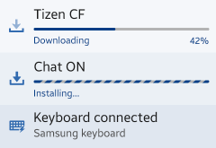

# Notifications

You should often inform your users of events taking place in your application while the user is either active in another application or has the device locked. In this case you can use the notification framework.

A notification is a way for your application to get the user's attention and politely ask the user to stop the current task and go to your application instead.

In the Tizen platform, there are various methods available to notify users of new events on the device. Notification panel and ticker notifications are provided as generic notification methods. You can also use pop-up and badge notifications.

The notification UI supports multimodal feedback, which is a combination of events from visual, auditory, and tactile interfaces.

There are different notification types ranging from low to high intrusiveness. You can select the mechanism that best suits the message you want to convey. A more important and time-critical message warrants a more intrusive notification type.

You can use the following types of notifications:

-   Notification panel
-   Pop-up
-   Badge
-   Full view notification
-   Instant notification

Keep the following guidelines in mind when creating notifications:

-   Do not overuse notifications. Choose appropriate notification types for each event and offer notifications in a manner that does not impede a user's task.
-   Use badges to show the number of updates. They can be applied to the UI components, such as application icon, tab, or list.
-   Continue to display information about a new event (including the dismissed event) even if the user has dismissed the notifications in the Notification panel.

## Notification Panel

In the Notification panel, the user can check what is happening and see missed events, such as recent text messages, calls, and emails. It is a simple summary of notifications that keeps users updated.

Users can access the Notification panel from anywhere in the OS simply by pulling down on the indicator, which normally contains the on-going task and the event notification.

**Video: Opening and closing the Notification panel (click to play)**

<video controls width="240">
  <source src="media/notifications_01_0.mp4" type=video/mp4>
</video>

If the content to display exceeds a single page, the screen can be scrolled up and down. The user can dismiss event notifications in the Notification panel by tapping the **Clear all** button. However, some non-removable notifications can remain. The on-going task notification shows current events (such as the status of a file transmission) or information about connected devices (such as a USB connection).

**Figure: On-going task display**

The event notification shows information about new events that the user has not checked yet, such as the title of the event, sender, short contents, app icon, and timestamp.

If an application has more than 2 event notifications, present them in a single notification. However, if it is important to have a path to each, you can display multiple notifications from a single application in the notification.

**Figure: Example layout for event notifications**

## Pop-up

You can use notification and toast pop-ups to notify the user of events or state changes.

### Notification Pop-up

Use the notification pop-up to deliver information or request user confirmation.

Depending on the nature of the information, notifications fall into one of the following categories:

-   **Basic information delivery**: This pop-up notification is temporary - its purpose is to deliver information to the user before disappearing from the application screen after a defined period of time. It can also disappear when the user taps an area outside the pop-up notification box.
-   **Important information delivery**: This pop-up is used to deliver important information or alert users of the crucial steps of a process. It remains on the screen until the user deliberately closes it by tapping **OK** or **Confirm**.
-   **Action/delete choice**: The user decision dictates the outcome of this notification. Use it to prompt user to confirm an action, or delete something that is not recoverable.

**Figure: Notification pop-ups**

### Toast Pop-up

Use the toast pop-up to inform the user of a task result or changes in the current state. When you notify task result using confirmation pop-up, or the user can see the result on the screen, displaying the toast pop-up can be redundant.

**Figure: Toast pop-up**

## Badge

Not all events require immediate notification. In such cases, you can use a badge to convey this type of non-urgent information (such as a new event or number of events). You can add a badge on the application icon, or the user can check it when launching an application. Using only badges is suitable for the least important events.

**Figure: Badge notifications**

Consider the following when creating badge notifications:

-   Only display badges for new and unread items.
-   Display them as a number, with the figure on the badge icon indicating the number of new and unread items.
-   If there are several new or unread items,  the number displayed in the badge must decrease as the user views or reads each item. The text informing the user of the new item must also disappear.
-   Place the badge icons at the top right corner of each icon or control.
-   Do not use more than 4 digits in a badge icon.
-   In-app notifications are not accompanied by sound.
-   In a list, new items typically also get a special treatment to draw the attention of the user.

> **NOTE**  
> You can customize badge notifications in the Web framework.

## Full View Notification

Use a full view notification when:

-   The user does not expect the notification
-   The event is time-critical, meaning that the user must take action before continuing with the previous task (for example, an incoming call or alarm).

Provide the action the user must take to dismiss this event. Use action buttons or gestures to dismiss or perform other tasks related to the event.

**Figure: Full view notification**

## Instant Notification

The instant notification is displayed on the indicator with an icon and text. When the information takes more than 1 line, the entire message can be displayed using the auto scroll.

Use instant notifications for:

-   Push notifications (such as missed call, new message, voice mail, email, SMS, or RCS IM).
-   Actions that affect the mobile storage space (such as delivery report, download, BT transfer, or progress).  
    After finishing an action, the indicator shows only the icon. A toast pop-up should appear with the operation result.

**Figure: Instant notification**

