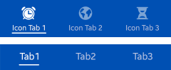

# Header

The header, which appears at the top of the application screen, is a word or phrase describing the screen content or purpose.

Depending on their format and function, headers fall one of the following categories:

-   [Basic header](#basic_header)
-   [Tab](#tab)
-   [Tab with a title](#tab_title)

## Basic Header

The basic header appears as a bar containing a string. When necessary, you can display a basic header within other UI elements, such as icons or buttons. In this case, make sure the header text is centered.

 

**Figure: Basic header**  

 

**Figure: Header with buttons**  

 

Keep the following guidelines in mind when including buttons in a basic header:

-   The title can be scrolled with the screen body content when the user swipes up to see more content. However, the title is fixed if an action, such as drawer or cancel/done, is placed on the title.
-   You can only place a function as a button in the header in an edit screen.

## Tab

Tabs help categorize content, and are placed at the top of the screen. Users can see up to 4 tabs on the screen, and they can flick the screen sideways to see more.

Keep the following guidelines in mind when using tabs in the header:

-   Use tabs to show the overall categories on the first screen.
-   Display several views, which are equally important.
-   Show internal categories as combinations of icons and text.
-   Prefer icons with labels. However, if the screen appears cluttered or it is hard to find proper icons, you can use only text.
-   Tabs containing icons with labels (up to 4) fit equally to the width of the screen.
-   Do not use buttons for other functions in the header if you are also displaying a tab at the top of the screen. In this case, find another location for the buttons.

 

**Figure: Tabs**  

## Tab with a Title

To add an additional title for all tab items, you can combine a row of tabs with a title. The tab with a title functions in the same way as the basic tab, meaning you cannot use buttons in the tab.

 

**Figure: Tab with a title**  

