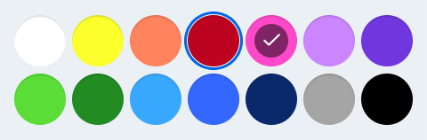

# Picker

You can include pickers in your application design to help users set the date or time, and select colors.

## Time Picker
You can use the following types of time pickers:

-   Time picker
-   Date picker

**Figure: Time picker**

The user can select setting values by tapping each field in the picker and sweeping sideways.

**Video: Time picker interaction (click to play)**

<video controls>
  <source src="media/designlibrary_03.mp4" type=video/mp4>
</video>

## Color Picker
The color picker provides a set of color cells. The user can select a color by tapping a cell. A color picker can be provided with or without a color palette, depending on the application.

**Figure: Color picker**

> **NOTE**  
> The supported color picker types are different in the Tizen native and Web frameworks.
