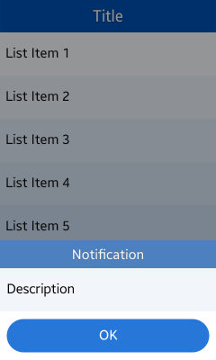

# Pop-up

Pop-ups can give users vital information when completing a task. They can carry a number of actions and are especially useful when the notification requires the user to respond.

You can use the following types of pop-ups:

-   Notification pop-up
-   Toast pop-up

## Notification Pop-up

Notification pop-up appears at the bottom of your application screen. Keep the following guidelines in mind when designing a pop-up:

-   Display the pop-up when your application requires immediate user attention.
-   Use pop-ups to provide information and prompt users to make selections for the next task.
-   Make various combinations of text, images, icons, and edit fields available so that the user receives the correct message and can take appropriate action.
-   Provide relevant buttons in case the user needs to confirm or cancel an action. Interacting with a button closes the pop-up. A pop-up with no buttons disappears from the user's screen after a predefined amount of time.

 

**Figure: Notification pop-up**  

 

## Toast Pop-up

Toast pop-up can be used to inform of simple notifications or changes in the current state.

When notifying information about the result of an action, use the action name, such as **Moved** or **Copied**.

 

**Figure: Toast pop-up**  

