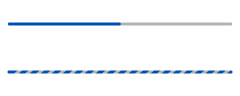

# Progress and Process

Activity indicators are used to communicate ongoing processes to the user.

If a specific task is running continually over a certain period of time, you should offer users a visual cue about its progress or process.

Use a progress indicator when the duration or volume of the entire task can be predicted and communicated to the user. Both relative and absolute units can be used. Fill the progress bar from left to right as the task is being completed to make your application's progress as transparent as possible.

 

**Figure: Progress indicators**  

 

Use a process indicator when the duration or volume of the task cannot be predicted, so you can only make users aware that the task is being processed. Display a process as an animation in a pop-up, list, or the header. Show the processing image in a part of the screen rather than in full screen.

 

**Figure: Process indicator in a pop-up**  

