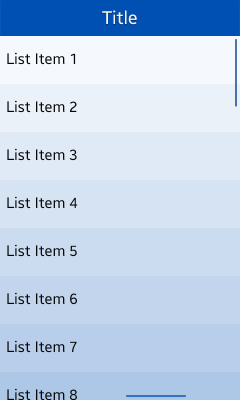

# Scroll

The body area supports the following types of scrolling and functionality:

-   [Scroll bar](#scroll_bar)
-   [Screen handler](#screen_handler)
-   [Fast scroll](#fast_scroll)

## Scroll Bar

Scrolling body content up and down displays the basic scroll bar, which offers visual information, such as the total length and location of a list.

However, the basic scroll bar disappears after a certain amount of time, and the users cannot adjust it by touch.

**Figure: Scroll bar**

## Screen Handler
You can apply additional handlers if your application requires faster scrolling.

However, use screen handlers only when the scrolling range is relatively long or if there is not enough space for users to tap on the object to scroll up and down.

**Figure: Screen handler**

## Fast Scroll

The fast scroll feature allows users to scroll rapidly up and down any list that includes an index.

Normally, the index is in alphabetical order, but it can also be based on fields, such as local language characters, numbers, and symbols.

**Table: Index order hierarchy**

| PRIMARY LANGUAGE                 | INDEX ORDER                      |
|----------------------------------|----------------------------------|
| Latin (including English) | 1.  Local language    2.  Symbols   3.  Numbers    |
| Non-Latin                 | 1.  Local language   2.  English  3. Symbols   4.  Numbers |

**Video: Interaction with fast scroll (click to play)**

<video controls height="400">
  <source src="media/designlibrary_01.mp4" type=video/mp4>
</video>
