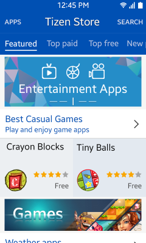
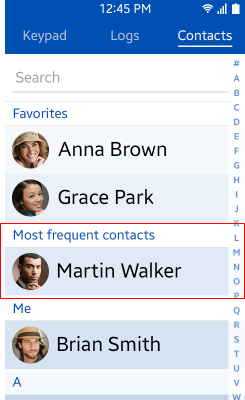

# Design Principles

In this section, we introduce the key design principles that have shaped Tizen and helped in setting it apart from other mobile operating platforms. These principles ensure every application people use to customize their phones is content-driven, focused, and tailored to user needs.

Familiarize yourself with the Tizen design principles so that you can put them to best use when developing your application.

## Content-driven

When designing your application, ensure it recognizes and delivers the most important content at the right time and in the right context.

The best way to do this is to make your primary information easily visible and accessible. This improves both usability and design.

When prioritizing your content and planning your information presentation, keep the following guidelines in mind:

### Showcase Primary Content

Compose your content so that important information stands out. Highlight primary content by applying different font sizes and colors or by changing the layout.

**Figure: Showcasing primary content**

### Present Information According to Importance

Offer information based on its degree of importance. For example, deliver simple messages, such as "Saving..." or "Deleting...", on the indicator to avoid interrupting the user in the main body of the application.

**Figure: Displaying a less important message in the indicator**

### Put the Emphasis on Fun!

Make the process of accessing content enjoyable for the users. By designing applications with visually compelling layouts and engaging, interactive graphics, you can enhance the user experience.

**Figure: Interactive view**

### Display Essential Information First

In the Detail view, show essential information on the first screen and enable scrolling down to see additional information.

**Video: Displaying more information with a scroll (click to play)**

<video controls height="400">
  <source src="media/designprinciples_01.mp4" type=video/mp4>
</video>

## Focused

In your application design, make sure that the major functions are easily available for the users.

You can differentiate functions by the degree of importance in various application environments, but always make sure you consider the most effective ways to use each function.

When determining focus levels in your application, keep the following guidelines in mind:

### Facilitate Access to Primary Functionality

Display the most used functions on the first screen. Use the **Menu** key to house any functions users need less frequently.

**Video: Functions located behind the Menu key (click to play)**

<video controls height="400">
  <source src="media/designprinciples_02.mp4" type=video/mp4>
</video>

### Only Display Essential Information as Default

Differentiate between the essential information that is always displayed and additional information that can be displayed only when a user requests it.

**Video: Hiding the name field (click to play)**

<video controls height="400">
  <source src="media/designprinciples_03.mp4" type=video/mp4>
</video>

### Minimize User Effort

By promoting user access to the major functions in your application, you minimize the effort required. For example, when a user wants to create a new item, you can automatically move the focus to the required input field and offer the virtual keypad.

**Video: Moving the focus to the input area (click to play)**

<video controls height="400">
  <source src="media/designprinciples_04.mp4" type=video/mp4>
</video>

### Make It Clear What Can Be Done

Disable or hide functions that are not available in certain circumstances. For example, you can disable the Save button to let users know that a required field is empty.

**Video: Indicating that an event cannot be saved (click to play)**

<video controls height="400">
  <source src="media/designprinciples_05.mp4" type=video/mp4>
</video>

## Tailored: Delivering Customization and Personalization

Users typically want to customize their applications based on their personal needs. Therefore, any Tizen application you develop should empower users to optimize it according to their personal tastes.

When planning the customization capabilities of your application, keep the following guidelines in mind:

### Understand Individual User Patterns

By taking the behavioral patterns of each user into account, your application can deliver a more personalized experience. For example, by ensuring the most frequently or recently used applications are easily accessible, you support users that want to find an application or content as quickly as possible.

**Figure: Frequently used contacts in the Contact application**

### Use Customization to Enhance Usability

Make sure you support customization that not only improves your application appearance but also enhances its usability. By providing accessibility functions, such as font sizes and a screen reader, you can help differently abled users navigate Tizen applications more conveniently.

### Make Recommendations

Based on the usage of your application, you can understand and recommend content the user wants. For example, by providing recommendations, Favorites, or History, you can help users perform tasks more conveniently and efficiently.

**Figure: Showing browsing history**

