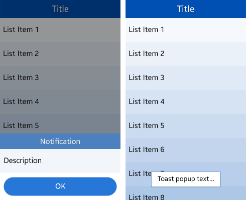

# New in Tizen 2.3

Tizen 2.3 is optimized for small screen UX. Especially it is fit for WVGA resolutions, so some changes have been made related to viewing content in a small screen device.

## Screen Structure

The layout structure primarily consists of the header and content areas. In a small screen, most application functions should be placed in the **More** menu. For more details, see [UI Overview](ui-overview.md).

**Figure: Application screen structure and the More menu**

## Notifications

When showing a pop-up, the width of the popup fits the width of the screen in portrait mode. For seamless usage, the pop-up appears from the bottom center of the screen. In addition, toast pop-ups can be used to inform the user of simple notifications or changes in the current state. For more information, see [Notifications](./basic-interactions/notifications.md).

 

**Figure: Notification and toast pop-up**

In addition to the major changes, there are the following changes in Tizen 2.3:

- **Header layout**: The header string is center-aligned. If a button is needed, place it as an icon or text. For more information, see [Header](design-library/header.md).
- **Controls**: New control elements suitable for the Tizen 2.3 light theme have been added. For more information, see [Asset Library](asset-library.md).
