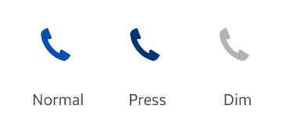

# Icons

Tizen 2.3 applications can use a variety of icons.

## Main Icon

The main icon represents the application. It is normally used on the **Home** screen. If you do use it in other applications, make sure that the main icon is noticeable on any background. The icons of the Tizen 2.3 platform have a circular shape.

 

**Figure: Main icons**  

 

The main icon should have the following properties:

-   **File format**: PNG file with a transparent background
-   **Size for a mobile device**: 82 x 82 pixels (based on the WVGA resolution)
-   **Size for the Tizen Store**: 512 x 512 pixels

Even though each icon on the **Menu** screen has a round frame on the edge of the circle, the frame is a UI element that only appears in the **Menu** screen. Do not use this type of frame when creating a main icon for your application.

> **NOTE**  
> Always surround each icon with 2 pixels of transparent free space.

 

**Figure: Main icon surroundings**  

 

## 2D Icons

The 2D icon style gives a generally round impression. The icons have 3 statuses (normal, pressed, and dim) and the color changes according to the status.

 

**Figure: 2D icons**  

 

You can design icons for your application based on your brand identity or character. However, to maintain visual consistency, always give priority to the Tizen 2.3 2D style. Carefully consider the color and size of the area where you position the icon and make sure the icon visible in each state.

When you design a 2D icon, make sure you represent its status (normal, pressed or dim) with the right color, as shown in the following figure.

 

**Figure: 2D icon status colors**  

 

**Table: 2D icon status colors**

| STATUS                   | COLOR                    | Comments                 |
|--------------------------|--------------------------|--------------------------|
|  Normal                  | \#0050b3                 |                          |
|  Pressed                 | \#125675                | Decrease brightness 25 from the normal value Normal: HSB(213, 100, 70)  Pressed: HSB(213, 100, 45) |
|  Dim                     | \#b2b2b2                 | Black opacity 30%        |
