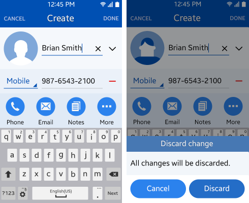

# Touch Feedback

You must give users feedback when they touch specific elements (especially buttons) on the screen. This supports communication between a user and the application.

To promote better touch interaction with visual cues, Tizen 2.3 offers several color changes and effects. The [buttons](../design-library/button.md) have separate states (normal, press, and dim) for each button type, such as list buttons.

 

**Figure: Tizen buttons**  

 

**Table: Button states**

| STATUS             | Normal             | Press              | Dim                |
|--------------------|--------------------|--------------------|--------------------|
| BG image           | \#2777d9           | \#1c5499           | \#71a0d9           |
| Font and icon      | White              | White              | White (50% opacity) |

In the normal state, the button is shown within a blue BG image. When pressed, the button color turns into a darker shade.

In the dim state, based on the color value of the normal status, apply 50% opacity to the button text.

The following figure illustrates button states (icon buttons in the edit mode of the normal state and a text button in the pressed state).

 

**Figure: Button examples**  

 

> **NOTE**  
> You can customize the button dim color in the Web framework.
