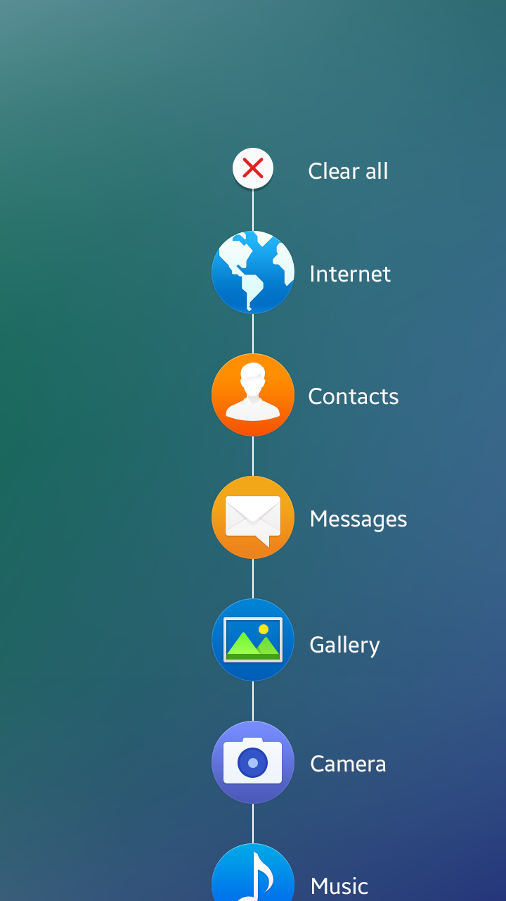

# App Handling

This section provides guidelines on how to design an app to launch and close. In this section, you can also find guidelines for allowing users to switch between the currently launched apps.

## Starting and Stopping an App

How you design your app to open and close is very important, because users begin to evaluate your app the moment they open it for the first time, and this evaluation process ends only after they have closed the app. The following lists basic guidelines for designing your app's opening and closing actions:
 

#### Make Your App to Start Immediately

Avoid providing additional steps or procedures that may annoy users. Once started, your app's top level view should show the essential functions and the overview of the app structure. Refer to [App Structure](app-structure.md) for details.
 

#### Indicate the Progress if It Takes Time to Launch

It is always best to design your app to launch immediately after users select it. If your app requires loading time before starting, provide a progress or activity indicator to inform users. Refer to [Progress Components](../ui-components/presentation-views.md#progress_) for details.

 

#### Maintain the Orientation

If you design your app to work in both landscape and portrait modes, design it to match the orientation users are in to avoid unnecessary adjustments. If your app only utilizes one orientation, design it to launch in that orientation. Users will figure out that they should rotate the device to view the content.

 

#### Provide a Short and Clear Tutorial if Necessary

It is always the best to design your app to be simple so that users can use it without tutorials. However, if you think users need specific information to use your app properly, provide an interactive tutorial session. When you do this, make your tutorial as interesting as possible to draw users' attention. Also, for those who already know what to do, design the tutorial with an option to skip it.

 

#### Avoid Asking Users to Evaluate Your App before They Use It

Users need enough time to actually use your app before forming opinions. You may want to know as soon as possible what users feel and think about your app, but asking them too early does more harm than good. It may irritate users or their opinions may not be fully formed. Therefore, allow enough time for users to experience your app before you ask them to rate it.

 

#### Design Your App to Remember User Activities

You can provide users with increased usability by designing your app to remember previous user activities. This way, users can always go back to the task exactly where they left it.

 

#### Provide Information about Unexpected Termination

Needless to say, it is always best to ensure that your app does not terminate unexpectedly in the first place. However, explain to users what had happened if it does, and provide them with a solution to avoid it and continue to use your app.

 

## Multitask Handling

Tizen supports multitask handling. Users can see the list of recently used apps in the Recent screen and switch between the apps by simply tapping the icons. Refer to [Recent Screen](../ux-overview/home-structure.md#recent) for details.

  

*Recent screen*

To support multitasking, your app should be capable of running in the background in a paused state when users leave it. When users switch back to your app, the process is resumed instantly

The following lists the guidelines for designing apps that support multitasking.

- Design your apps to be ready for unexpected switching.
  *   Users can switch between apps any time. Your app should be capable of saving the current state appropriately to allow users to continue to use your app from where they left off. If it is a content-oriented app, such as a game, or a media player, your app should pause automatically to prevent users from missing content.

- Continue and complete user task, if appropriate.
  *  Apps, such as music players or call apps, should run in the background when users open another app in the foreground.
  *  Design your app to run in the background and complete a user task if the user explicitly intended it, or if it is a simple task which does not require additional user input.
