# Navigation Design

When you design a Tizen app, ensure that the changes in the depth in an app are reflected on the screen. The navigation design should consistently provide information about the depth of the view users are currently accessing.

Navigation design is one biggest factor that decides an app's usability level. Therefore, plan the navigation structure and consider all related issues as early as possible in your development process.

 

## Back and Cancel

Users navigate from one screen to another by tapping interactive UI elements (for example, lists and pop-ups) that lead to the information they are looking for. After completing certain tasks, users can return to the previous screen by tapping the hardware 'Back' key on the device or the on-screen 'Back/Cancel' button.

 

#### Back Key

For a device to be compliant with Tizen's Compliance Specification, it MUST provide a Back key (or a Back button) through dedicated physical (hardware) or software implementation. In general, the Back key is provided at the bottom of the device and is used to return to the previous screen or to cancel a task that is in progress.

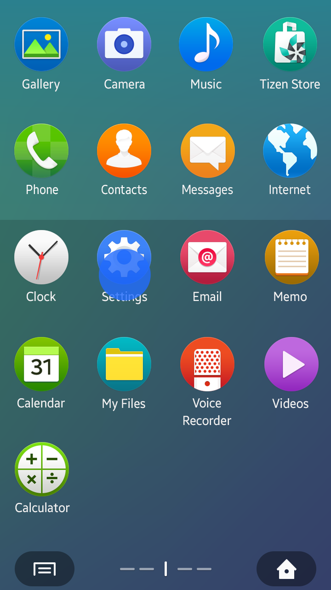  

*Navigation using the Back key*

The Back key can also be used to dismiss the virtual keypad, pop-ups, or notifications.

 

#### On-Screen Back Button

In Tizen 2.4, a layout design with a title bar requires the on-screen 'Back' button. An on-screen 'Back' button should be located on the left side of the title bar. The on-screen 'Back' button performs tasks that are nearly identical to the physical Back key.

You cannot provide the on-screen Back button:

-   On the top view.
-   If 'Done' or 'Delete' action buttons are used with 'Cancel' on the same screen, a 'Cancel' button should be provided instead of the 'Back' button.

 

#### Cancel Button

A 'Cancel' button is used to close a screen for the current task and return to the previous screen. A 'Cancel' button may be used with other action buttons, such as 'Send', 'Done', and 'Delete'.

 

## Home Key

A press on the Home key sends the currently running app to the background and displays the Home screen.

Also, users can touch and hold the Home key to access the Recent screen and tap an app icon to launch it again. Refer to [Recent Screen](../ux-overview/home-structure.md#recent) for details.

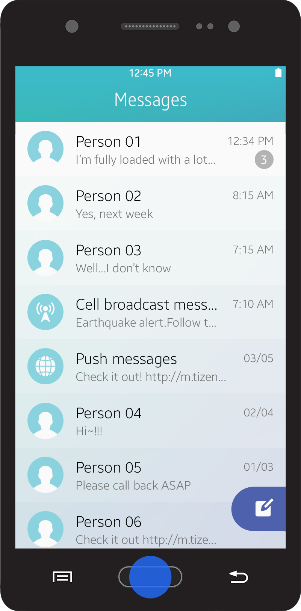    

*Navigation to the Home screen*

 

## Navigation within an App

Users navigate in an app by selecting information or performing actions. Users can open a new screen to obtain the information they need or carry out a task by tapping an interactive UI component.

> Tabs do not actually change screens, but they change views in the same screen. If users press the 'Back' key after tapping a tab, it will not bring them to the previous tab, but it will close the current screen and bring them to the previous step's screen. Not every change in views is kept in the historical stack. It does not remember the view changes, but it only remembers the actual change of the screen.

The following lists cases where the views change within a screen:

-   Switching views between tabs
-   Sorting or filtering a list
-   Zooming in or out a screen

The following figure explains the difference between the changes in screens and views.

 
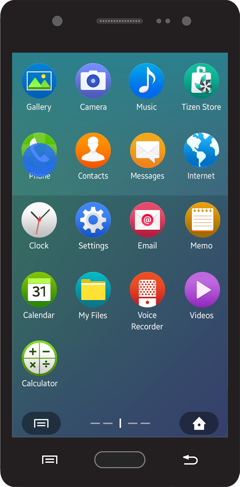  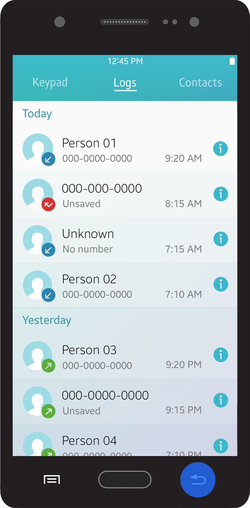 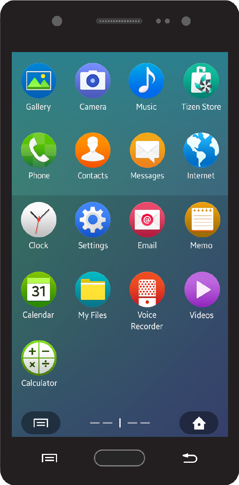    

*Navigation when view changes*

 

## Navigation between Apps

Sometimes, an app launches another app while performing a user task. When this happens, the newly launched app runs in the foreground and the other app runs in the background.

When the task is completed, the newly launched app is automatically closed and the previous app runs in the foreground again. During the task, users can always return to the previous app by canceling the current task via the 'Back' key or the 'Cancel' button.

For example, users may launch a gallery app to attach an image while writing an e-mail or a message. The gallery app is automatically closed after attaching the image. Users can also cancel attaching the image and close the email or messaging app using the 'Back' key.

       

*Navigation between apps*

 

## User Actions Inside an App

You can use the basic elements provided with the Tizen 2.4 SDK to design various features for your app. This section provides information about designing patterns for data creation and modification.

 

#### Creating Entries

'Create' is the most commonly used action button to help users manage data. Almost every app requires this action. It is best to adhere to the basic Tizen platform principles by giving users the basic functions they expect, in the places where they expect to find them.

In many cases, creating an item means users are required to input information in multiple fields. However, users want to create items quickly and easily. Users may get annoyed if they are required to fill in too many fields.

To allow the users to create new items quickly and easily, refer to the following guidelines:

-   Provide a 'Create' action button in the 'More' menu screen. If the 'Create' action button is an important feature in your app, you may provide it as a floating action button (refer to [Floating Action Button](../ui-components/assist-views.md#floating_) for details).
-   Include only mandatory and common fields at first, rather than presenting all the detailed fields.
-   Add related fields when users tap the 'Add' button. These fields can be removed by tapping the 'Remove' button.
-   Provide up to four buttons on the first page. The last button should be the 'More' menu button if you need to provide more than four action buttons.
-   Suggest predefined value to make it easier for users to understand.
-   Show the fields users previously used by default. If a field has been just added (without any value input) or removed, set the value as predefined value (if one exists) and do not provide this field as a default next time.

 
  

*Create mode*

 

#### Selecting Multiple Items

Users often need to manage multiple items simultaneously, such as when they want to delete several items at once. You can support actions like this by offering the multiselect feature in your app.

The multiselect feature works when the user taps 'Delete', 'Move', or 'Copy' action buttons on the 'More' menu screen. It provides a checkbox for each item listed for multiple selections.

You can also offer information about the selected items (for example, the number of items selected) in the header area. Both the list and grid views support the multiselect feature. See the table below:

|                         | Initial state          |  After selection        |
|-----------------------|-----------------------|------------------------|
|  Single select mode     |  Select \_item         |  (Move to the next step)|
|  Multiselect mode       |  0 selected            |  1 selected             |
|  Multiselect mode(limited)|      0 / %d selected |      1 / %d selected    |

*(%d indicates a limited number)*

     

*Multi-selection in a list view*

  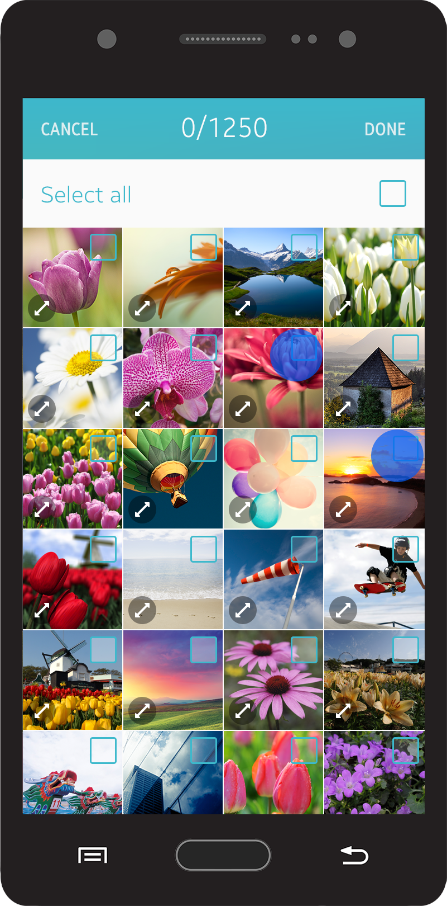 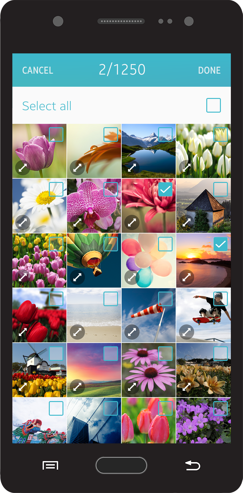  

*Multi-selection in a grid view*

 

The 'Select All' action button scrolls with the list. Tapping the 'Select All' button selects all the items in the list, and tapping it again deselects all the selected items.

 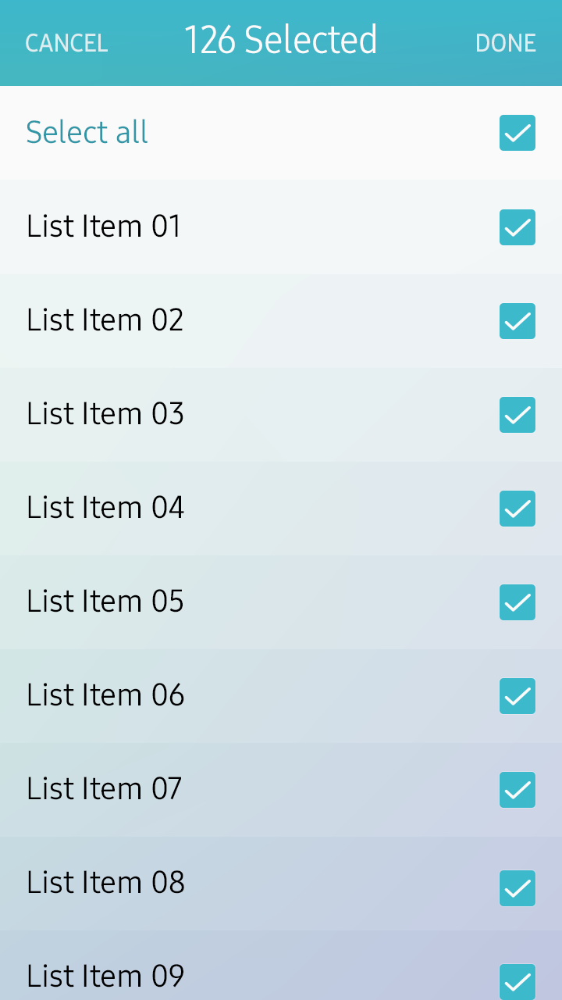  

*Select All feature*

 

#### Deleting Items

You can provide a 'Delete' action button on the list view or grid view screen layout. For a detail view, you can provide a 'Delete' action button in the 'More' menu screen.

 

-   Deleting Items in the List View

In the list view, users can select and delete multiple items using the multiselect mode.

Once the user has deleted the data, provide a visual cue to let users know that the action was successfully completed. You can also display the current status via text, such as "No images," if necessary. Do not provide a confirmation pop-up to ask for the final confirmation, since users' intentions have already been fully reflected during the item selection. If it takes a long time to complete the delete action, provide an activity indicator to show the progress (refer to [Progress Components](../ui-components/presentation-views.md#progress_) for details).

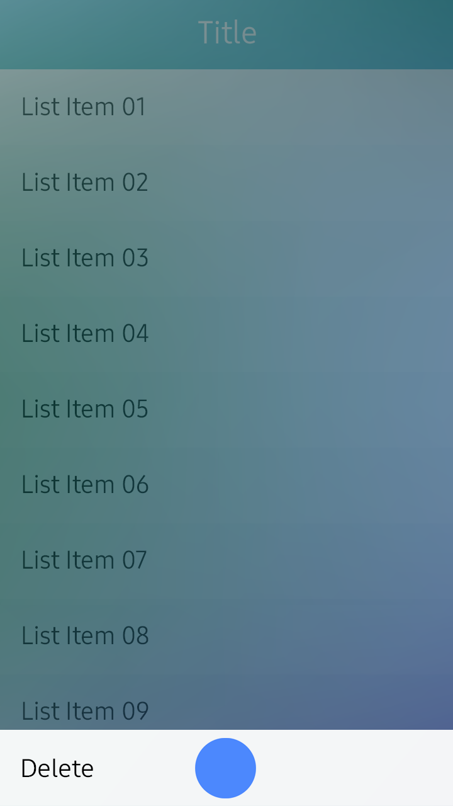      

*Deleting items in a list view*

 

-   Deleting Items in the Detail View

Provide a confirmation pop-up message to prevent unintended deletions. Do not use a pop-up message if the delete (or remove) action is not actually destructive. This is usually the case when users delete shortcuts to actual objects rather than the objects themselves. You can provide simple feedback, such as visual effects or toast pop-up, to explicitly show the deletion progress.

    

*Deleting items in a detail view*

 

#### Confirming a Task

Your app can provide many actions and some of them may be irreversible. If actions are irreversible, you should ask users to verify if they truly want to proceed with the action.

 

-   Cancel and Done

In Create or Edit mode, the title bar (refer to [Title Bar](../ui-components/navigation-elements.md#title_) for details) provides 'Cancel' and 'Done' buttons (depending on the situation, a 'Send' or 'Delete' button can be provided instead of a 'Done' button). Users can tap the 'Done' button to finish their task. If users tap the 'Cancel' button, provide a pop-up confirmation window to verify that they want to discard their work. If there is no change in the content, you don't need to confirm anything.

 
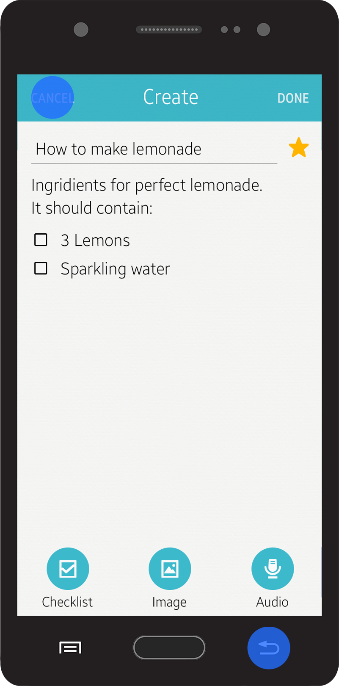 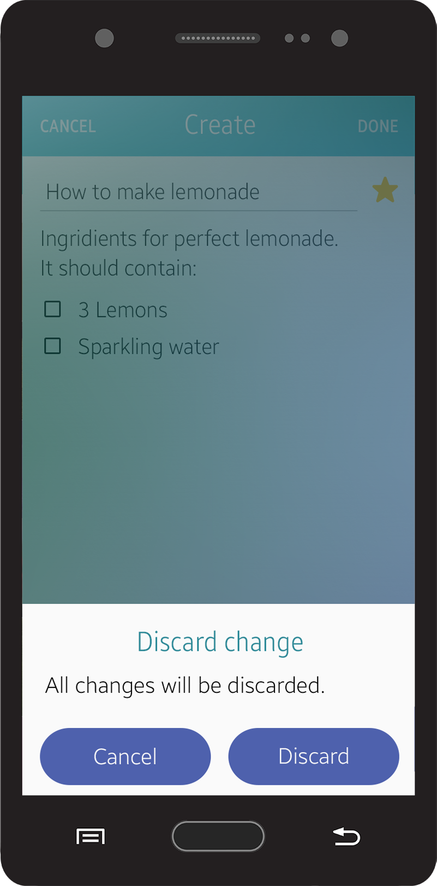

*Explicit save*

In the simple Edit mode, like when changing a value in the Settings menu, you don't have to provide a pop-up message asking users about discarding their work. In these cases, it is recommended that your app save the most recent state when users return to the previous screen. For that reason, there is no 'Cancel' or 'Done' button.

    

*Implicit save*

-   Pop-up Confirmation

If the action is destructive, you can use a pop-up confirmation. Use simple and clear text to inform users of the situation.

|  |  |
| :--: | :--: |
| *Do* | *Don't* |
