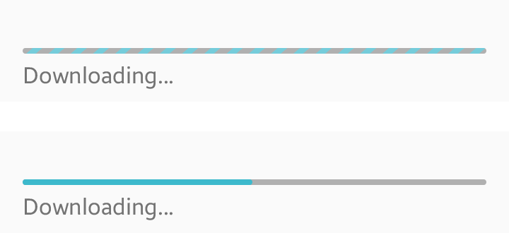
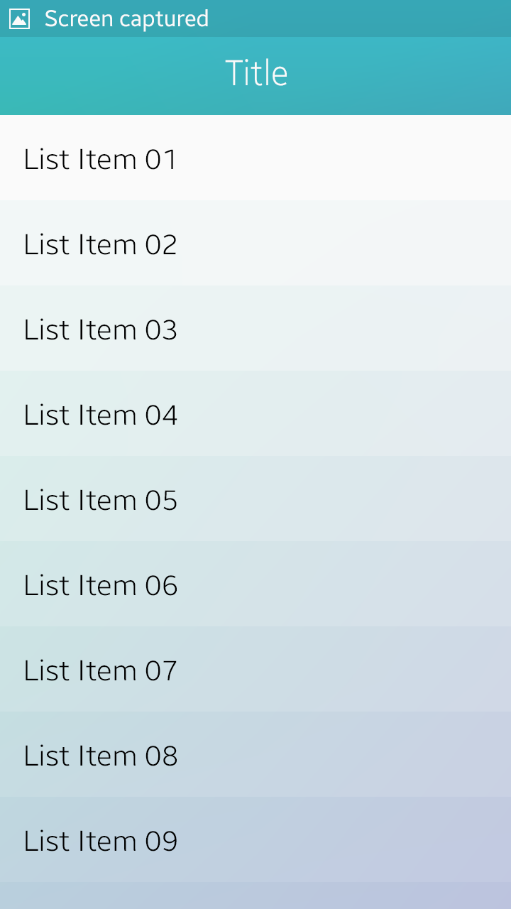
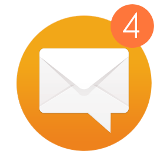

# Notifications

You can use the notification API to notify users of the new events in your app, such as new messages or updates.

Notifications draw users' attention and provide information about new events or relevant actions. To take instant actions, users can directly access your app from the notification. They can also stay on the current task flow and take actions later from the notification panel, where the logs for unchecked messages are kept.

The Tizen notification UI supports multimodal feedbacks, which are combinations of visual, auditory, and tactile events.

 

The following lists guidelines for designing notifications.

-   Do not overuse notifications. Choose appropriate notification types for each event and offer notifications in a way that does not annoy users.
-   Use badges to show the number of notifications. Badges can be placed on image-based UI components, such as app icons and image tabs.
-   Continue to display information about new events even if the user has dismissed the notifications in the notification panel.

 

## Accessing the Notifications

On the notification panel, users can check the current event they are notified for, or the events they have missed, such as recent text messages, missed calls, and emails.Users can access the notification panel from anywhere in the OS simply by dragging down the status bar, which normally contains ongoing tasks and event notifications.

 

*Opening and closing the notification panel*

There are two different types of notifications: Event notification and progress notifications.

Event notifications show information about new events that has not been checked by users. Information provided with event notifications may include the title of the event, sender, short content, app icon, and a timestamp.

If an app has more than two event notifications, they will be presented on the Notification panel as a single notification. However, you can design your app to display multiple notifications on the Notification panel if you need to provide individual paths to each event or if your app does not allow users to view multiple content items.

  

*Example layouts for event notifications*

Progress indicators and activity indicators show the progress of current tasks, such as file transfers or installations, with a progress bar. They should be designed to allow users to cancel the task in progress. You can provide a pop-up window that contains a 'Cancel' button, or design your notification to open your app on a screen that contains a 'Cancel' button.

  

*Progress/activity indicators*

Users can dismiss event notifications by tapping the 'Clear all' button on the Notification Panel. However, some non-removable notifications, such as progress notifications, will not be dismissed with the 'Clear all' button.

You can also include mini controllers to help users conveniently control apps, such as incoming calls or music players. When you design a mini controller, provide a 'Close' button in the upper-right corner of the screen to allow users to easily close it.

  

*A mini controller for music control*

If the list of notifications and mini controllers is too long to be displayed on a page, users can scroll up or down to see the rest of the list.

 

## Instant Notifications

Instant notifications include an icon and text, and are displayed on the status bar at the top of a screen. When the information requires more than one line, the entire message can be displayed using the autoscroll feature. 
Use instant notifications for simple notifications (such as missed calls, voice mail, or progress states).

    

*Instant notifications*

 

## Active Notifications

The active notification includes an icon, text, and action buttons, and is displayed at the top of the device screen. Text includes a title, a subtitle, and body text, and each of them takes up one line (A double-lined body text may be used in the absence of subtitle). You can include up to three action buttons (text or image buttons) in an active notification.

Active notifications are displayed for a few seconds and are automatically dismissed. Users can also manually dismiss them by dragging them up the screen.

Design the dismissed notifications to remain on the notification panel until users read them or clear them. If the notification is for a continuing event, such as a call or an alarm, it is displayed until the event ends. You can turn off the auto-dismiss option to maintain the notifications on continuing events. In this case, you should manually set the expiration time for the notification.

-   Use active notification only for time-sensitive events with higher priority which require instant user actions.
-   Do not use active notifications to notify events of low importance, or to provide contextual or background information.

  

*An active notification*

 

## Full View Notifications
Use a full view notification when the event is urgent and time-sensitive (for example, an incoming call or alarm). Users must take actions to a full view notification before they can continue with their previous tasks.

On full view notifications, provide action buttons or gestures to dismiss events or to perform other related tasks.

  

*A full view notification*

We recommend that you design your app to display an active notification instead of a full view notification, when the screen is turned on and the device is unlocked. To allow the device to display a full notification instead, you should define the active notification for the particular app as a full view notification.

 

> **Tips for choosing the notification types**  
> Refer to the following table to choose the notification type that best suits the message you want to deliver. A time-critical message with higher priority may require a more intrusive notification type.

 

  |Type of notification alert      |          Category of event|
  |--------------------------------|---------------------------|
  |Full view notification(when the screen is locked) Active notification(when the screen is unlocked) and Notification panel |    Time-critical events with high priority Ex) Incoming calls\*, alarms\*, reminders, etc.|
  |  Active notification & Notification panel  |     Events that require user responses  Ex) Messages, Chat events |
  |Instant notification & Notification panel | Events that are not involved in other categories.    Ex) Missed calls, missed events, emails, sign-out notifications, progress notifications (Downloading, Uploading, Installing, Import), completion notifications (Download, upload, installation, import, screen capture), connection error notifications (Wi-Fi, Tethering), Data limit notifications, etc.|
  |Notification panel (optional)|    Events with lower priority Contextual or background information   Ex) Public or undirected social updates, software update notifications, weather information, location information, etc.

\* Although Tizen's notification API is well suited for designing notifications for time-sensitive events, it has only a limited set of features available. We recommend that you design your own notifications to include unique features and visual effects for notification views. When you design your own notification views, follow the basic design rules to avoid confusion and maintain consistency.

 

## Badges

Not all events require immediate notifications. You can use badges to notify users of events that do not require immediate attention. Place a badge on the application icon so that users can check notifications when launching an app. Badges are suitable for the least important events.

  

*A badge*

The following are guidelines for creating badge notifications.

-   Display badges only for new and unread items.
-   Display badges as numbers indicating how many new and unread items there are.
-   If there are several new or unread items, the number displayed in the badge must decrease as users view or read each item. The text informing users of the new item must also disappear.
-   Place badges at the top-right corner of the icons or tabs (image tabs only).
-   Do not use more than 4 digits in a badge.
-   Badge notifications do not provide sound alarms.
