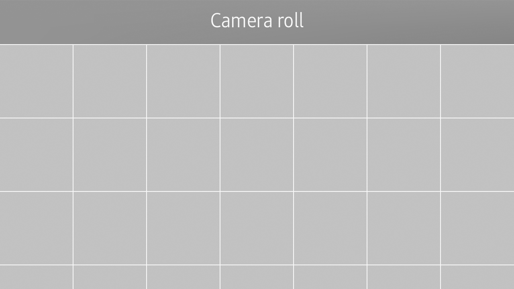
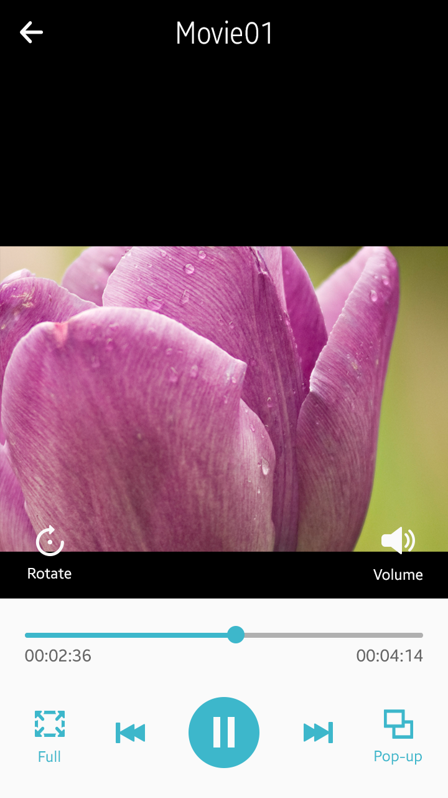
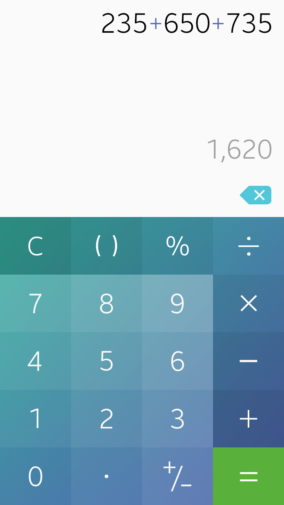

# Screen Orientations

#### Portrait Orientation

The portrait orientation is the default screen orientation for most app designs because it's the way people naturally hold their devices.

 
   

*Portrait screen layout*

#### Landscape Orientation

If your app serves for special purposes where the landscape orientation is more appropriate, you can design your apps to use the landscape mode as the default orientation. Games or cameras are good examples where the landscape mode may be used as the default screen orientation.

> Tizen supports reverse landscape orientation as well. However, we advise you against using this orientation unless it is necessary.

By designing a screen in landscape orientation, you can take advantage of the wide screen to present specific content to users. However, before using the landscape mode in your app, make sure it serves users' actual needs. For example, just because your app uses a camera or presents pictures or videos is not a good reason to design your app in landscape orientation, especially if those features are rarely used.

Consider using the landscape orientation when:

-   The presentation of the primary content in the app depends on the device orientation (for example, camera apps controlled by the built-in sensors).
-   The primary content viewed in the app depends on the device or screen orientation (for example, images and videos in the Gallery and Video apps).
-   The app is normally used in a docked state, fixed on a stand (for example, Maps, GPS apps).
-   If typing is often used in your apps, the landscape orientation can provide a larger on-screen keypad, resulting in a better usability (for example, messaging apps).
-   You can design your app to provide advanced features in the landscape orientation. By including only the features people frequently use, keep the portrait orientation simple and easy to use, while providing more specific and complex features in the landscape orientation (for example, the scientific mode in a Calculator app).

 
   

*Landscape screen layout*

#### Transition between Different Screen Orientations

Natural transition between portrait and landscape orientations is a standard practice in today's mobile devices. Relative screen layout allows for identical UI component placement in different view modes. However, controls on the screen may have to be adjusted to suit the space allowed in the given orientations. When you design an app that supports both the orientations, ensure that all the features offered in one orientation are also available in the other.

 
   

*Portrait and landscape orientations*

 

The following figure explains why landscape orientation is ideal for video playback. While the same video can be displayed in both the portrait and landscape orientations, landscape orientation is capable of making the best use of the screen size and displaying larger content.

 
   

*Portrait and landscape orientations in a video app*

 

The Calculator app in the following example switches between the two views depending on the physical orientation of the device. Note that it displays more advanced features only in landscape orientation.

 
   

*Portrait and landscape orientations in a calculator app*
