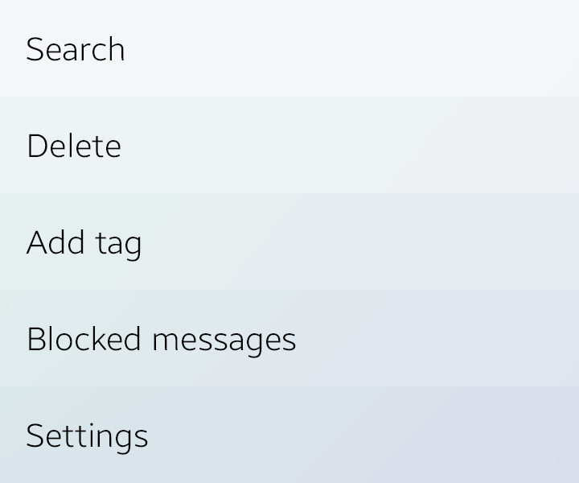
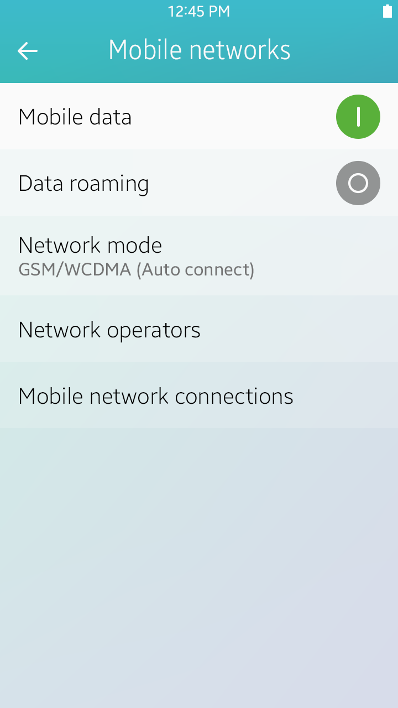
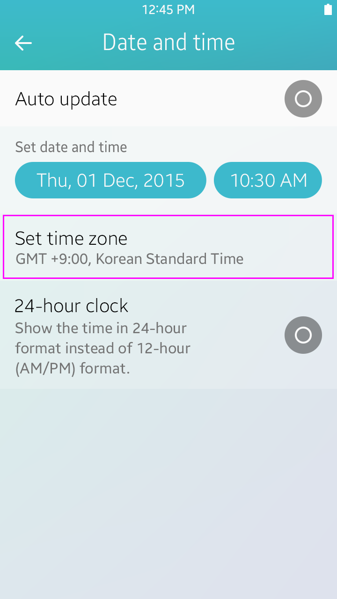
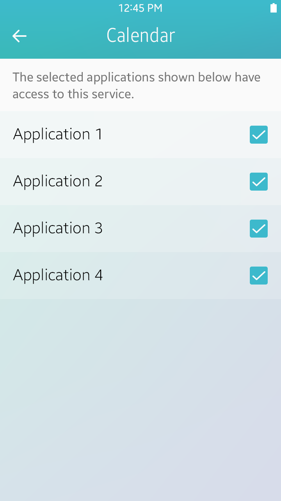
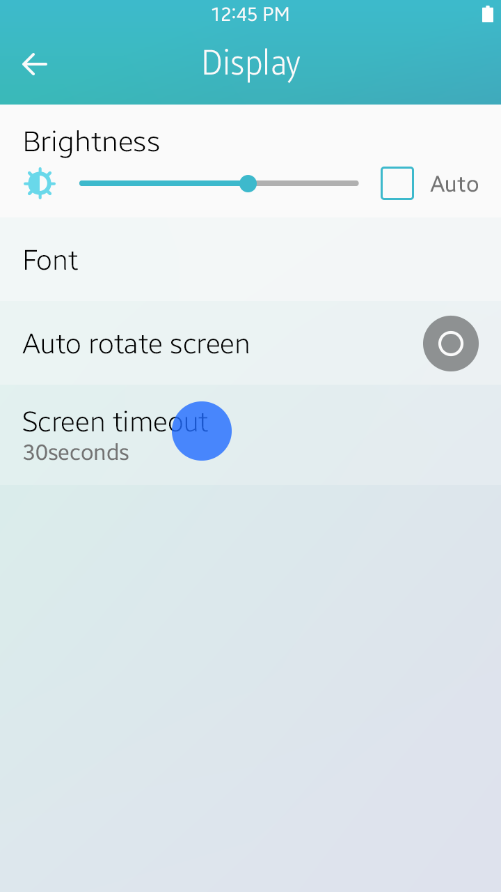
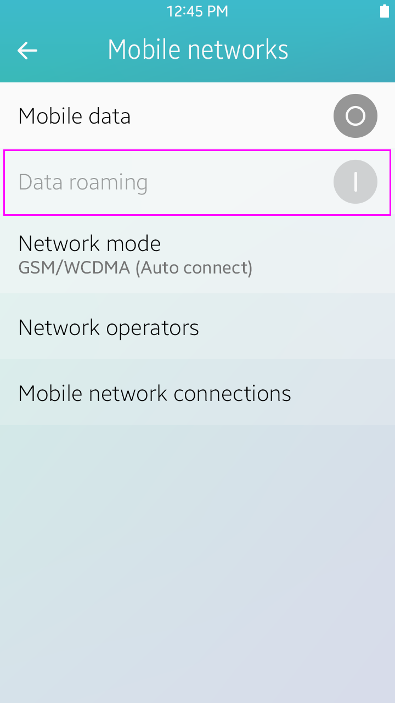
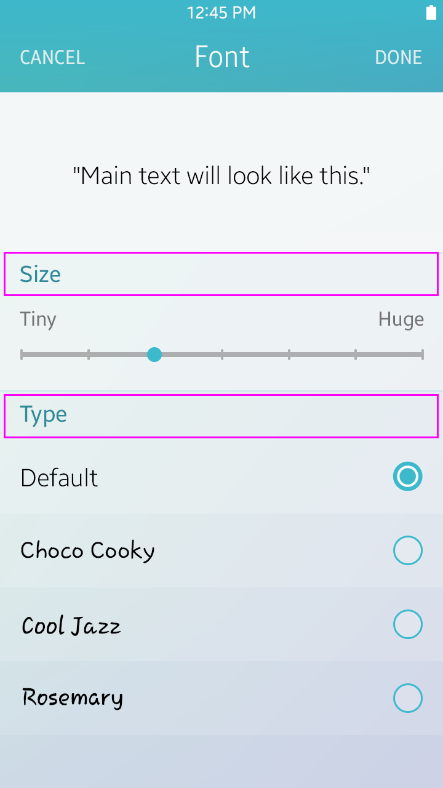

# Settings

In Settings, users can view and customize various functions. By offering the right settings at the right time, you can enrich your app's user experience.

## Designing Settings

The Settings menu is provided in the 'More' menu. Since users don't change their settings that often, emphasizing this menu is not necessary. Put Settings below all other items, except 'About' or 'Help'. If your app provides 'Settings', 'About', and 'Help' menus, the order should be 'Settings' > 'About' > 'Help'.

   

*Settings in More menu*

Settings can be easily complicated if you do not organize the preferences by purpose. Complicated settings cause users difficulty in finding the Settings menu.

To keep things simple, keep the following guidelines in mind when designing settings:

-   Include a Settings menu only when it's a user preference.
-   Include a Settings menu when the user may not want to change the function frequently.
-   If you expect most users to set the same value and to not change the setting again, you can use fixed behavior without providing a Settings menu.

Try to reduce the number of Settings options on the first level of your app. It allows users to view the Settings menus easily. You can reduce Settings menu options by combining similar options into one menu. (Ex. Lock screen and Security, Privacy and Safety)

Design the preferences as shown in the following figure. Classify your app settings by function and group them with different names.

   

*General settings*

 

 

## Preference UI Controls

The UI control types for settings are as follows:

 

#### Secondary Text

Secondary text is used to show statuses or help text.

-   Status text : Informs users of the present state of an item in the list.
-   Help text : Provides useful information about the item in the list.

     

*Secondary texts*

 

#### Toggles

These controls help the user enable or disable specific functions.

Refer to [Toggle](../ui-components/user-input-components.md#check_) for more information.

 

*Toggles*

 

#### Sliders

These controls are useful when adjusting Settings values in multiple or consecutive steps. An optional image that explains the function of the bar can also be included.

Refer to [Slider](../ui-components/user-input-components.md#slider_) for more information.

  

*Slider*

#### Checkboxes

This control is useful when showing items selected for a specific function.

Refer to [Checkbox](../ui-components/user-input-components.md#check_) for more information.

  

*Checkbox*

> A toggle is used to enable or disable a specific function. However, a checkbox is used to show what items belong to a specific function. A checkbox is only used for a few functions, such as remembering a password.

 

#### Radio Buttons

This control is used when setting an option when only one choice can be made.

Refer to [Radio Button](../ui-components/user-input-components.md#radio_) for more information.

    

*Radio button*

 

## Tips for Designing Settings

Here are some tips for designing settings.

 

#### Dependency

If a setting option is dependent on another setting, dim the option when the primary or related setting is off. When dimmed, the setting's status can be maintained or not, depending on the situation. For example, to use the GPS and Wireless networks options in the Location service setting, users must agree with a legal information pop-up confirmation. So when Location service is turned off, the GPS and Wireless networks options are dimmed and the values are turned off. However, if Mobile data is turned off in the Mobile network setting, Data roaming is dimmed and its value is maintained. So when roaming, users can just turn on/off Mobile data to use mobile networks after enabling Data roaming value just one time.

 
  

   

*Dependency*

There are many examples of dependent settings in the UI. In the General settings, when Flight mode is enabled, Wi-Fi is disabled. When the incoming call sound value is reduced to "0," the device switches to vibrate mode. You need to consider all dependent functions when designing settings.

 

#### Multiple Choice

When changing settings where only one option can be selected, you can use a pop-up window with radio buttons. If there are too many options for a pop-up window, you can use full view scrolling window to display all the items in the list.

 
  

*Multiple choice*
 
 

#### Group Indexing

Use the group index view to easily classify and associate features. It makes settings look neat and well organized.

 
   

*Group index view*

 

#### Default Values

When choosing the default values of your settings, you should consider carefully. Most users don't change settings values too often. Some users may not even know that there is a settings option they can use. If users feel that the default operation of your app is complicated, they will think your app is just difficult.

Keep the following guidelines in mind when choosing default values:

-   Choose a value that will be suitable for the majority of users.
-   Choose a value that is known to be safe and generally adequate.
-   Choose a value that provides better security.
-   Choose a neutral value.
-   Choose a value that uses fewer data and battery resources.
