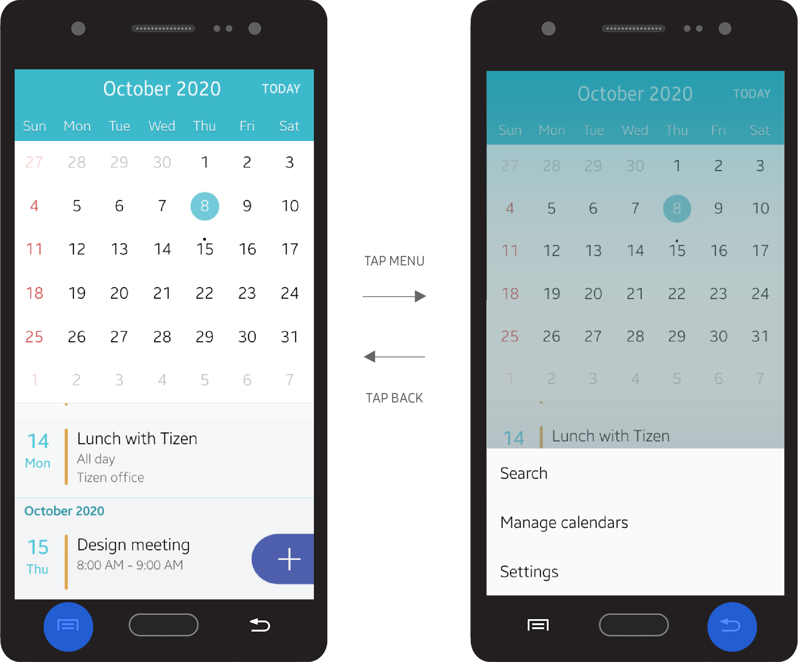

# Design Principles

Tizen design principles explained in this section of the document are provided to suggest clear guidelines for developers, to design simple and easy-to-use apps for everyone.

 

## Focus on the Primary Goals

Ensure that your app allows users to easily use its major features. You can simplify the screen layout of your app and emphasize important features so that users can easily find them

 

#### Identify the Primary Goals and Provide the Components in a Noticeable Way

Display the most frequently used features on the first screen. Floating action buttons are a convenient option that allows users to access the main features quickly and easily. On the other hand, less frequently used features may be placed on the 'More' menu screen. Users can access the 'More' menu by pressing the Menu key.

By focusing on the primary features and presenting them in a consistent way, you can design an app that is easy to use.

 
  

*A floating action button*

 

 

#### Provide Essential Information First and Give Additional Information upon Request

Users are only interested in the information they need. Therefore, provide only essential information on the screen. You can provide more detailed information when a user requests it or takes action, but avoid trying to provide everything on one screen.

When you design a screen layout, ensure that you include enough empty space between information. It increases the readability and allows users to be able to understand given information more easily.

 

 

#### Provide One Simple Way for Users to Achieve their Goals

Providing multiple ways to access a single feature may confuse users. Tizen aims to keep its design simple and practical because it targets a wide range of users, from beginners to advanced users. Hidden gestures or menus without any visual cues are not recommended when designing Tizen apps.

Avoid using hidden gestures or additional quick actions that require tutorials in your design. Find the most effective and reasonable way to perform an action and allow users to access it via an action button. If you need to add subordinate actions in the design, provide them in 'More' menu.

  

*The More menu*

 

## Create a Sense of Flow

A good flow in the app design makes it easy for users to make decisions. Users may lose interest in your app if it is hard to navigate and difficult to understand.

 

#### Provide Users with an Accessible Structure

Ensure that the access flow of your app does not include any redundant steps. Eliminate unnecessary dialog boxes and confirmation windows that slow down user progress. Users want quick access to information, to complete their tasks in fewer steps.

Help users instantly perform simple actions. For example, quick access to the Internet browser is a good feature to have. By facilitating user access to major websites, you can minimize the effort required.

  

*Quick access feature for an Internet browser*

 

#### Use Animations and Visual Cues

Stacked layers create a visual hierarchy, and each layer comes with a clear direction of movement. When layers are assembled well, they create a flow that guides the users. For example, to inform users of new events that require user's attention, active notifications always slide down from the top, over the current screen users are working on. Refer to [Animations](../introduction/styles/animations.md) for more information.  
 
  

*An active notification.*

Visual cues are another way to guide users. Also, carefully placed pop-up notifications and toast pop-up messages will help users complete tasks more easily by providing them with essential information about the process.

#### Provide Consistent Design

A consistent design allows users to learn how to use new features faster. Consider what common actions are noticed by the average user and design your features to use the same actions. For example, the Back key is generally used for returning to previous pages or canceling current tasks. So, in your app, design the Back key to return to the previous page or cancel tasks, and avoid using it for something else.

  

*Navigating back from a message*

 

## Provide Information at a Glance

When you design screens for your app, ensure that the purpose of each screen is easily understood at a glance. Design the primary information to be clearly visible and easily accessible.

#### Present Information in Order of Importance

Ensure that your app screen displays the most important content first. For example, in the detail view, show the essential information on the first screen and allow users to scroll down to see the additional information.

   

*Display important information first*

#### Create Clear Distinctions between the Information on the Screen

Use different font sizes, weights, colors, and layouts to separate the information on the screen and allow important information to stand out. For example, the Contacts menu includes tabs, a search field, a contact list, and a floating action button on the same page. However, different styles and colors applied to these elements enable users to clearly separate them.

  

*Clear distinction between different types of information*

#### Make the Touchable Elements Look Touchable

Apply consistent designs for interactive elements on the screen, and disable or hide the elements that are not available. For example, you can disable the 'Done' button to let users know that a required field is empty.

   

*A disabled Done button shows that the required field is not filled.*
