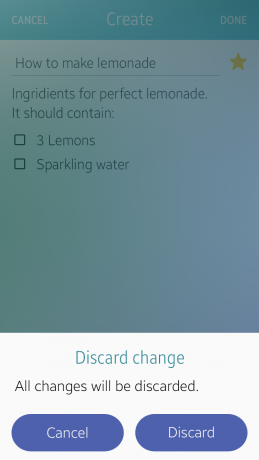
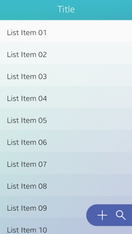

# Assist Views

Assist views are used to provide the user with additional information to complement the main content. The following UI components are assist views:

-   [Pop-up](#pop-up)
-   [Toast pop-up](#toast-pop-up)
-   [Context pop-up](#context-pop-up)
-   [More menu](#more-menu)
-   [Floating action button](#floating-action-button)

## Pop-up

Pop-ups are temporarily displayed on the screen to provide information or to ask for user confirmation. Pop-ups allow the user to take instant action for events.

To learn how to implement a pop-up, see [Popup](../../../native/guides/ui/efl/component-popup-m.md).

Pop-up

## Toast Pop-up

Toast pop-ups are used to deliver simple notifications.

To learn how to implement a toast pop-up, see [Popup](../../../native/guides/ui/efl/component-popup-m.md).

Toast pop-ups

## Context Pop-up

Context pop-ups are used to provide options for the currently selected objects.

To learn how to implement a context pop-up, see [Ctxpopup](../../../native/guides/ui/efl/component-ctxpopup-m.md).

Context pop-up

## More Menu

The 'More' menu is used to provide users with access to actions not available on the main screen.

To learn how to implement a 'More' menu, see [Ctxpopup](../../../native/guides/ui/efl/component-ctxpopup-m.md).

'More' menu

## Floating Action Button

The floating action button allows the user to take action at any point on a screen. The button does not scroll with the content, because it is vertically fixed on the screen. However, the user can horizontally drag or flick the button to adjust its horizontal position.

Floating action button
