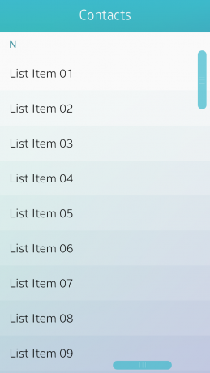

# Navigation Elements

Navigation elements are used to browse content and switch between screens. The following UI components are navigation elements:

-   [Title bar](#title_)
-   [Tabs](#tabs_)
-   [Navigation bar](#navi_)
-   [Scroll components](#scroll_)

## Title Bar

The title bar appears at the top of the screen to inform the user of the current location in an app. It consists of the title text and action buttons. The title text on the title bar must be center-aligned, and a maximum of 2 lines are allowed for the text. On the title bar, you can provide action buttons, such as a 'Back' button (an arrow), and 'Cancel', 'Done', 'Send', and 'Delete' text buttons for the edit mode, depending on the level of information and features provided in the app.

The following conditions and restrictions apply for action buttons on the title bar:

-   If the app has multiple levels of information, a 'Back' button can be placed on the title bar to allow the user to return to the previous level.
-   To avoid confusion, place only a 'Back' button (an arrow) or the edit mode text buttons ('Cancel', 'Done', 'Send', and 'Delete') on the title bar.

To learn how to implement a title bar, see [Naviframe](../../../native/guides/ui/efl/container-naviframe.md).

 

  
Title bar

   
Title bar with a 'Back' button and a title bar with other action buttons

## Tabs

Tabs are used to categorize different types of content. The user can switch between different views by tapping the tabs. Tabs can be located at the top of the screen or below the title bar. Each tab consists of a tab bar and a content view.

The Tizen mobile SDK provides basic scrollable and unscrollable tabs for your app design. For scrollable tabs, you can specify the width of the tabs, if necessary. For unscrollable tabs, the width is automatically set based on the number of tabs in the bar.

The following guidelines apply when including tabs in the header:

-   Include tabs on the first page to show the different categories.
-   Use icons with text labels for the tabs. Text descriptions can be used, if the screen layout does not allow the use of icons or if an appropriate icon is hard to find.
-   If you use unscrollable tabs, do not include too many tabs on the bar.
-   Each tab must have its own page view.
-   Balance the content to allow each tab to contain equally-important amount of information.
-   Do not include action buttons in the header, if the tabs are placed at the top of the screen.

To learn how to implement tabs, see [Toolbar](../../../native/guides/ui/efl/component-toolbar.md).

 

  
Tabs

   
Tabs with a title

 

 

## Navigation Bar

A navigation bar can be placed under the title bar to display paths in an app. It helps the user navigate the app and find the information they want by showing the app's structural information.

To learn how to implement a navigation bar, see [Naviframe](../../../native/guides/ui/efl/container-naviframe.md).

 

  
Navigation bar

 

 

## Scroll Components

Scroll components are used to indicate the user's current position. Scroll components allow the user to jump directly to the information they are looking for.

The following scroll components are available:

-   Scroll bar
-   Index scroll
-   Page indicator

 

#### Scroll Bar

The scroll bar appears when the user scrolls a view that is too long to be displayed on one screen. There are 2 types of scroll bars available for use in your apps: ones with handles and others without. Using a scroll bar with a handle, the user can move directly to the part they want by vertically dragging the handle.

To learn how to implement a scroll bar, see [Scroller](../../../native/guides/ui/efl/container-scroller.md).

   
Scroll bars

 

#### Index Scroll

The index scroll allows the user to rapidly scroll up and down a list that includes an index. The index is generally displayed in an alphabetical order, but different types of indexing are available as well, for example, by language, numbers, and symbols.

To learn how to implement an index scroll, see [Index](../../../native/guides/ui/efl/component-index-m.md).

  
Index scroll

 

#### Page Indicator

The page indicator is used to show how many pages are available in an app and which page is currently displayed.

To learn how to implement a page indicator, see [Index](../../../native/guides/ui/efl/component-index-m.md).

  
Page indicator
