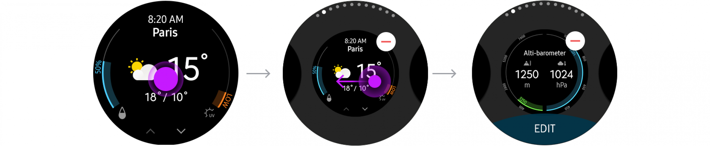
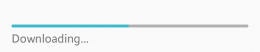

# Presentation Views

Presentation views are used to display the main content of an app in different forms. The following UI components are presentation views:

-   [List view](#list_)
-   [Grid view](#grid_)
-   [Group index](#group_)
-   [Progress components](#progress_)

 

## List View

The list view is used to display multiple items on one screen. It is the most basic view. You can include various UI elements, such as text, icons, images, or buttons, as list items.

To learn how to implement a list view, see [Genlist](../../../native/guides/ui/efl/component-genlist-m.md).

 

  
List view

 

## Grid View
The grid view is used to display multiple images.

To learn how to implement a grid view, see [Gengrid](../../../native/guides/ui/efl/component-gengrid.md).

 

  
Grid view

 

## Group Index

The group index is used to present sorted and grouped items.

When creating a group index, you can use various sorting and grouping criteria, such as alphabetical order, categories, time, or date.

To learn how to implement a groud index, see [Genlist](../../../native/guides/ui/efl/component-genlist-m.md).

 

  
Group index

 

## Progress Components

Progress components provide the user information about ongoing tasks. They are indicators displayed as bars or circles.

There are 2 different types of progress components available:

-   Progress indicator
-   Activity indicator

To learn how to implement progress components, see [Progressbar](../../../native/guides/ui/efl/component-progressbar-m.md).

 

#### Progress Indicator

The progress indicator provides the current status of an ongoing task with a scale. You can use a progress indicator to inform the user of the current status of tasks and include information, such as the estimated time of completion.

 

   
Progress indicators

 

#### Activity Indicator

The activity indicator is used to inform the user that a certain task is in progress. Use an activity indicator when the time until completion is unknown.

 

  
Activity indicator
