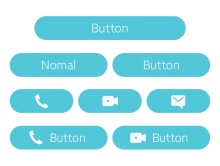
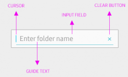
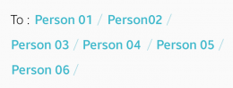
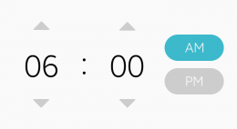
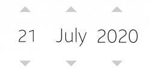
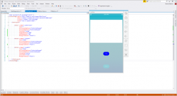

# User Input Components

User input components are used to collect user input for specific tasks. The following UI components are user input components:

-   [Button](#button_)
-   [Checkbox components](#check_)
-   [Radio button](#radio_)
-   [Text input](#text_)
-   [Dropdown menu](#drop_)
-   [Slider](#slider_)
-   [Picker](#picker_)

 

## Button

A button is used to allow user interactions to trigger events. On a button, you can include text, an image, or both.

The following button types are available:

-   Circle button
-   Box button
-   Bottom button

To learn how to implement a button, see [Button](../../../native/guides/ui/efl/component-button-m.md).

 

#### Circle Button

A circle button is a simple icon that the user can easily understand. You can provide text labels under the icons to further enhance user understanding.

  
Circle buttons

 

#### Box Button

A box button is displayed as a rounded box shape. You can include text, icons, or both in them.

  
Box buttons

#### Bottom Button

A bottom button is used for main actions. It is fixed at the bottom section of the screen and does not scroll with the content on the screen.

  
Bottom buttons

 

## Checkbox Components

Checkbox components are action icons that allow the user to switch certain features on or off, or to select various options. These icons are frequently used in the screen designs of galleries, lists, timers, and calendars.

The following checkbox component types are available:

-   Toggle
-   Checkbox
-   Favorite

Use simple and flat pictographic icons when you design checkbox components. Tizen assigns system colors for checkbox and radio buttons. For other icons, colors may be selected according to the significance of the icons.

To learn how to implement a checkbox, see [Check](../../../native/guides/ui/efl/component-check-m.md).

 

#### Toggle

A toggle is used to allow the user to switch a feature on or off.

  
Toggles

 

#### Checkbox

A checkbox is used to allow users to select or clear items, or to confirm tasks.

  
Checkboxes

 

#### Favorite

Favorites are used to allow users to tag items for future reference.

  
Favorites

In the Toggle and Checkbox Icon Pack, you can find the action icon examples created for various screen sizes. This package includes icons designed in Adobe® Photoshop® format, so that you can customize and use them for your own designs.

 

 

## Radio Button

A radio button is used to allow the user to select an item from a list of multiple choices.

To learn how to implement a radio button, see [Radio](../../../native/guides/ui/efl/component-radio-m.md).

  
Radio buttons

 

 

## Text Input

The text input component provides an input field for the user to enter text information.

  
Typical text input component parts

The following text input component types are available:

-   Single-line text input
-   Multi-line text input
-   Text enveloper

The text enveloper provides an extended functionality to text input. It recognizes the delimiters between text input and binds the entries, such as email addresses or keywords, in meaningful or functional chunks, so that the user can individually control or modify them. The enter key input ( ↵ ), comma ( , ), and semi colon ( ; ) are generally used for text delimiters, but you can define your own delimiters to suit the type and purpose of your app.

To learn how to implement a text input component, see [Entry](../../../native/guides/ui/efl/component-entry-m.md).

   
Text input and text enveloper

 

 

## Dropdown Menu

A dropdown menu allows the user to select an item from a list of multiple choices. A list of items is displayed when the user taps the dropdown menu.

To learn how to implement a dropdown menu, see [Hoversel](../../../native/guides/ui/efl/component-hoversel.md).

  
Dropdown menu

 

 

## Slider

A slider is used to adjust a value within a certain range. You can include a description or an icon that explains the slider's value range. The user can tap or drag the slider bar to increase or decrease the value. You can also provide numbers on the slider to indicate the value.

To learn how to implement a slider, see [Slider](../../../native/guides/ui/efl/component-slider-m.md).

  
Sliders

 

 

## Picker

A picker allows the user to select a specific value or multiple interconnected values from multiple options.

The following picker types are available:

-   Number picker
-   Date and time picker
-   Color picker

 

#### Number Picker

A number picker allows the user to select a specific number.

To learn how to implement a number picker, see [Spinner](../../../native/guides/ui/efl/component-spinner.md) and [Flipselector](../../../native/guides/ui/efl/component-flipselector.md).

  
Number pickers

 

#### Date and Time Picker

A date and time picker allows the user to set the date and time for different user apps using a specific picker type:

-   Time picker
-   Date picker

To learn how to implement date and time pickers, see [Datetime](../../../native/guides/ui/efl/component-datetime-m.md).

 

  
Time picker

   
Date pickers

 

#### Color Picker

A color picker allows the user to select a color from a set of colors.

To learn how to implement a color picker, see [Colorselector](../../../native/guides/ui/efl/component-colorselector.md).

  
Color picker
