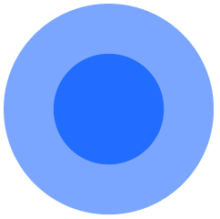
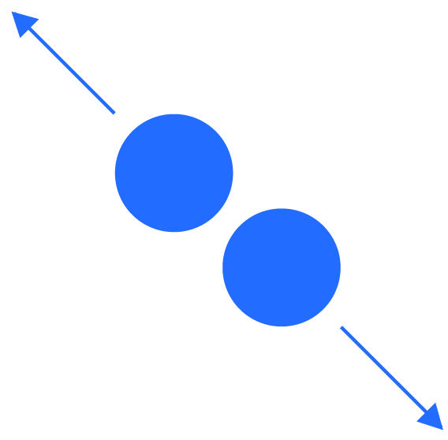
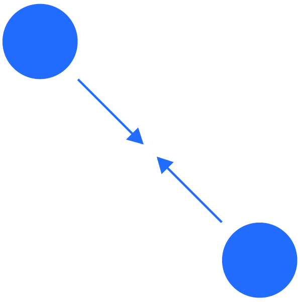

# Gestures

The Tizen platform supports a wide variety of gestures that allow users to directly access content on touch screen devices. For example, users can tap the screen to select an element, swipe to scroll through content on the screen, or drag and drop an element to move it.

When you design your apps, make sure you match the gestures in your app with those provided by the Tizen platform. This ensures consistent user experience, especially when multiple apps are running at the same time. The following lists guidelines for designing new gestures for your apps.

> -   DO NOT use the basic touch gestures defined in this guideline for different actions.
> -   DO NOT assign custom gestures for the basic actions that already have common gestures assigned to them.

The basic touch gestures provided with the Tizen SDK will work just fine with most of the apps you design. However, if you are designing unique apps such as games, you may want to invent more creative touch interactions.

Also, provide appropriate feedback for all interactions to make your app responsive.

The following table lists the basic Tizen gestures you can use to offer intuitive touch interactions.

 

  |Name        |     Symbol              |                                   Description|
  |------------|-------------------------|----------------------------------------------|
  |Tap         |   |            Selects an item or executes functions if the area has no other touch interaction applied.|
  |Double tap  |   |    Zooms in to the predefined view level. Returns to default view level in zooming (if already zoomed in).|
  |Touch and hold |  |  Executes specific functions. On the Home screen, enters edit mode. In apps, selects text.|
  |Swipe / Flick  |  |       Swipe is used to scroll through a list of items or to pan the screen.                                                                                            Flick is a quick swipe. It is used to quickly scroll through a list of items or to quickly pan the screen.|
  |Drag and drop |   |   Touching, holding, and then dragging an object moves it to the desired location when the user releases his or her finger.|
  |Zoom in      |    |       Touching two fingers to the screen and spreading them apart zooms in on the screen.|
  |Zoom out     |   |       Touching two fingers to the screen and pinching them together zooms out on the screen.|
