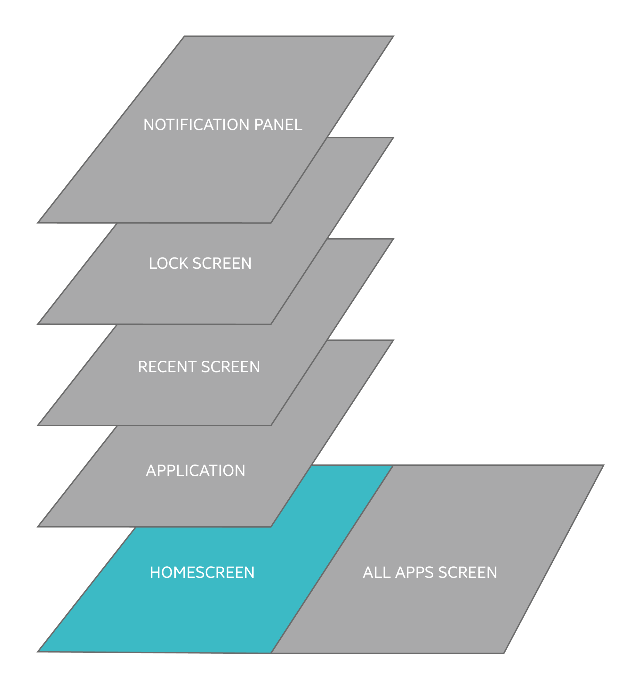
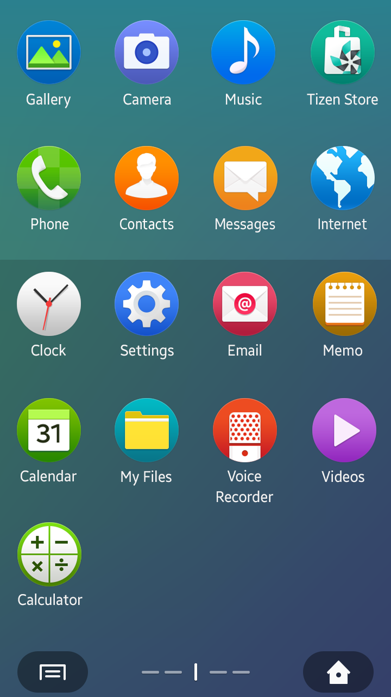
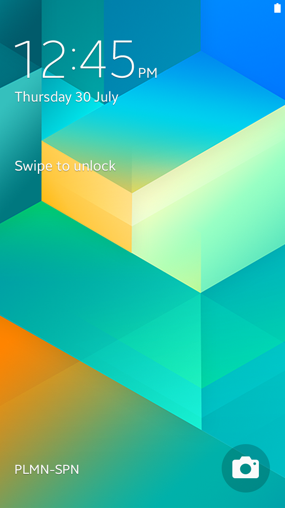

# Home Structure

This section provides information about the following main elements to enhance your understanding on the Tizen mobile platform.

-   [Home screen](#home)
-   [All apps screen](#all)
-   [Recent screen](#recent)
-   [Lock screen](#lock)
-   [Notification panel](#noti)

 

#### Home Screen

The Home screen is where widgets are located. Widgets display the main information of an app or provide users with added functionality to launch certain features in an app. Users can add new pages by adding a widget or by tapping the 'Add' button on the All apps screen. The Home screen supports horizontal scrolling.

On the Home screen, two fixed buttons are located at the bottom corners. The bottom-left button is the Menu button that is used to show the Home settings, and the bottom-right button is used to direct users to the All apps screen.

   

*Home screen*

 

#### All Apps Screen

The All apps screen shows all the apps that are installed on the device. A user-created folder will also be shown on the All apps screen.

On the All apps screen, two fixed buttons are located in the bottom corners of the screen. The bottom-left button is the Menu button that is used to show the All apps settings, and the bottom-right button is used to direct users to the Home screen.

   

*All apps screen*

 

#### Recent Screen

The Recent screen is where a list of recently used apps is displayed. On the Recent screen, users can switch between the apps that they have accessed recently. Users can also remove individual apps, or all the apps in the list simultaneously from the Recent screen. Refer to [App Handling](../design-patterns/app-handling.md) for detailed information.

Users can open the Recent screen by pressing and holding the hardware Home key. They can then tap an app in the list to re-open it. Tapping the Clear all button at the top of the list clears all the entries listed in the Recent screen. Users can also remove an individual app in the list by dragging it to the left or right.

   

*Recent screen*

 

#### Lock Screen

Because the Lock screen is the first screen the users see each time they wake up the device, it has to offer an aesthetically pleasing design. A Lock screen should have a simple and easy-to-understand design.

Other than presenting time and date information, the Lock screen also provides convenient options for replying to received messages, emails, or missed calls.

   

*Lock screen*

 

#### Notification Panel

The notification panel allows users to view unread notifications, provides access to specific device settings including network connection status, through the Quick settings panel. Users can access the notification panel by dragging down the status bar at the top of the screen.

The Quick settings panel contains shortcut buttons that allow users to switch between modes and turn specific features on or off. Refer to [Notifications](../design-patterns/notifications.md) for detailed information.

     

*Notification panel*
