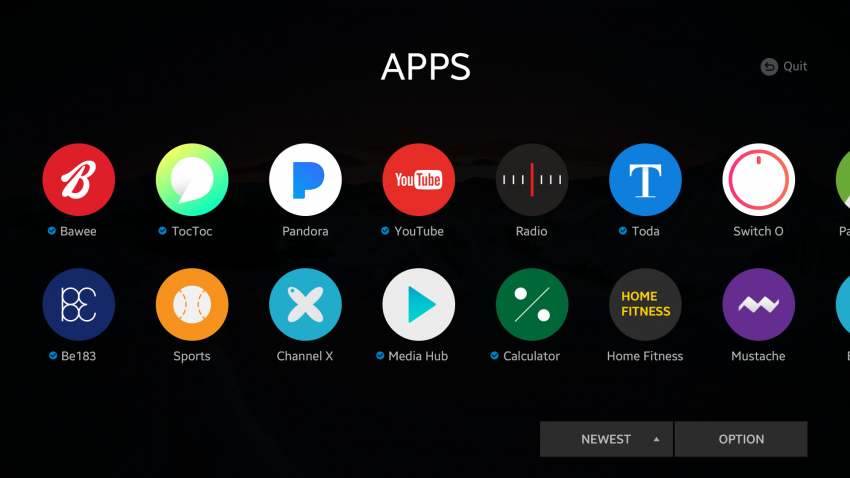
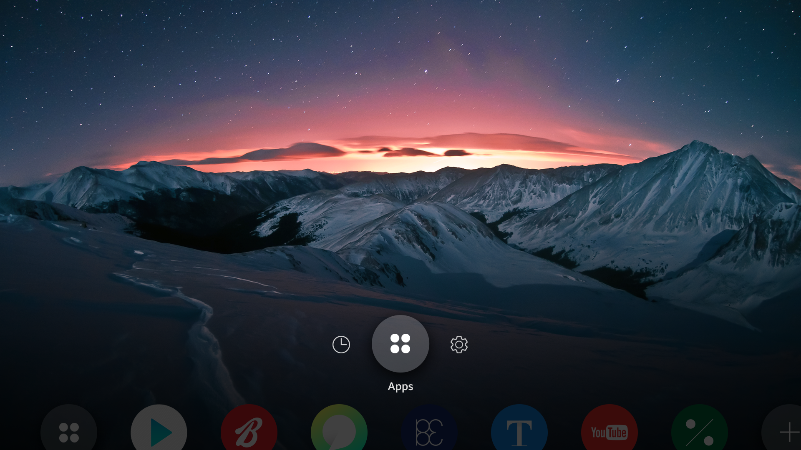
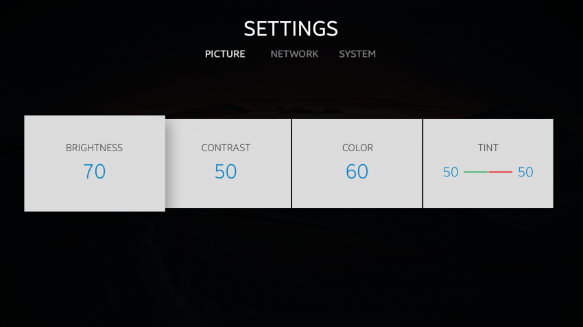
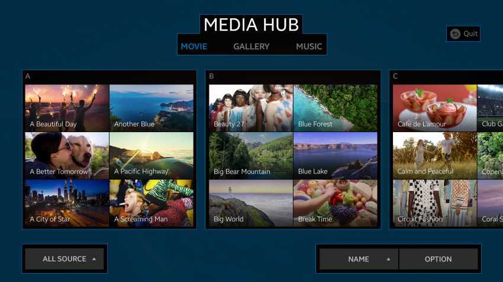

# Design Principles

The Tizen 4.0 TV design principles provide a clear and comfortable
visual identity for your application. The harmonious and delightful
elements help the user get information easily and enjoy content fully.

There are 3 design principles used in Tizen 4.0 TVs:

-   [Simplicity](#simplicity)
-   [Natural intuitiveness](#natural-intuitiveness)
-   [Breathing space](#breathing-space)

## Simplicity

Using many decorative elements on the screen at the same time can confuse and distract the user.

Simplify your application design to allow the user to clearly identify the content.

### Circular Icons

Tizen 4.0 TV icons are circular, covering a smaller area than
rectangular icons. Consequently, the user can see more of the screen
background.

*Circular icons taking less space on the screen.*

### Hidden Inactive Icons

An inactive icon partly hides itself to take up even less space on the screen. This approach also allows the user to recognize active icons without visual interruption from inactive icons.

*Inactive icons are hidden.*

### No Unnecessary Decorations

Within functional design elements, clean up unnecessary decorations, such as a divider bar. Instead, use more functionally-effective visual expressions or separate information. It makes the UI look cleaner and more organized.

*No divider bar between different pieces of information.*

## Natural Intuitiveness

Enhance the usability and make the interface naturally familiar to the user by, for example, using shadow effects. This allows the user to access content and information easily with a pleasing natural visual balance.

### Shadow Effect

Shadow effects can add subtle but clear emphasis to generated items. The effect is natural and consequently also harmonizes with the content. The user can focus better without any visual strain.

*Shadow effect emphasizes the element.*

## Breathing Space

A screen that is full of design elements can be eye-catching, but it makes the user unable to focus on any specific item. Use screen space properly to guide the user's attention.

### Allow Empty Space

A right amount of empty space between different pieces of information makes the UI both easier to understand and more pleasing to look at. Do not think that precious screen space is wasted. Properly used empty space is a proven technique for better screen design.

*Leave breathing room between the elements.*

### Prioritize and Balance

Prioritize elements on the screen based on their importance, and balance the primary and secondary elements accordingly. When the information is correctly balanced, the most important content elements are displayed in the most visible manner.

*Less important back key information is dimmed.*

