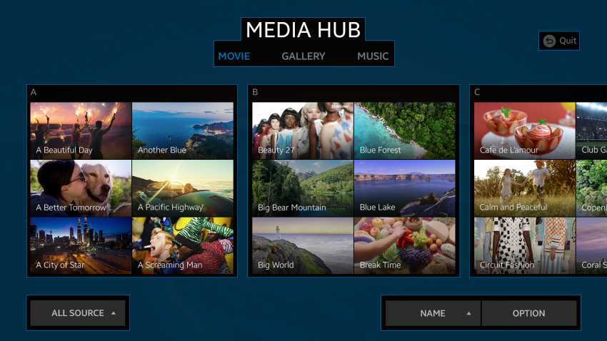

# Breathing Space

A screen that is full of design elements can be eye-catching, but it makes the user unable to focus on any specific item. Use screen space properly to guide the user's attention:

-   [Allow empty space](#Allow-Empty-Space) on the screen to improve the user experience.
-   [Prioritize and balance](#Prioritize-and-Balance) content elements based on importance.

## Allow Empty Space

A right amount of empty space between different pieces of information makes the UI both easier to understand and more pleasing to look at. Do not think that precious screen space is wasted. Properly used empty space is a proven technique for better screen design.

*Leave breathing room between the elements.*

## Prioritize and Balance

Prioritize elements on the screen based on their importance, and balance the primary and secondary elements accordingly. When the information is correctly balanced, the most important content elements are displayed in the most visible manner.

*Less important back key information is dimmed.*
