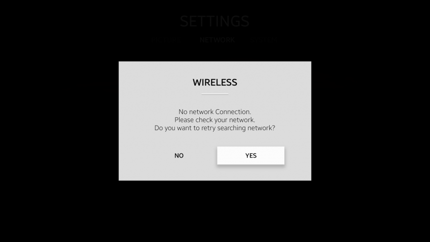
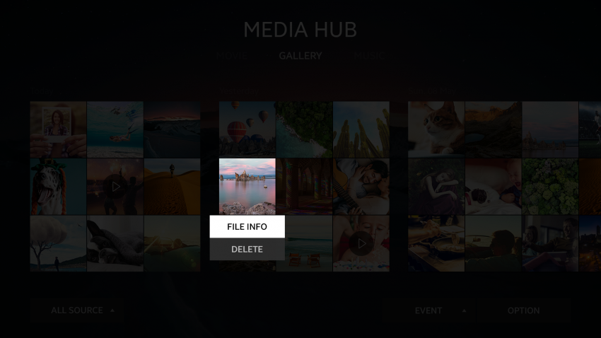
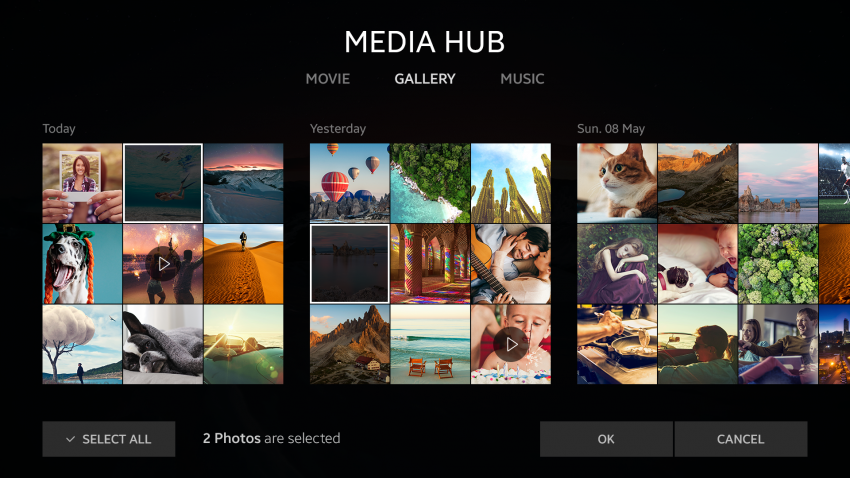
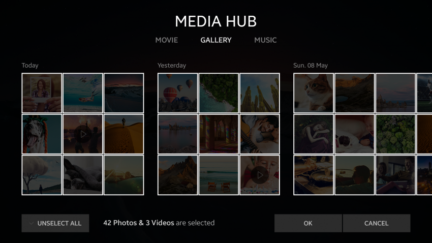
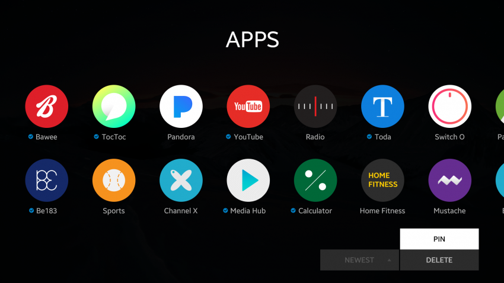
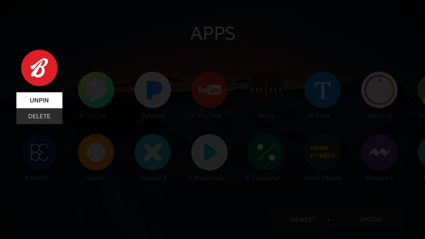

# Actions

The user can edit or change the content and confirm notifications using supported actions.

The following basic actions are supported on the Tizen 4.0 TV platform:

-   [Cancel or confirm](#cancel-or-confirm)
-   [Delete](#delete)
-   [Multi-select](#multi-select)
-   [Pin or unpin](#pin-or-unpin)

## Cancel or Confirm

The user can dismiss (cancel) or confirm an action by selecting the applicable action button on an action popup.

 
*Popup cancel and confirm*

## Delete

The purpose of a delete action is to eliminate content entirely.

The user can delete the selected content. To delete 2 or more content items, the user must multi-select the items or press the **Select All** button.

After all content is deleted, the **No contents** text is shown on the screen.

 
*Delete*

## Multi-select

A multi-select action is used to select 2 or more items in select mode. It helps the user to quickly apply identical actions to multiple items.

 
*Multi-selecting items*

## Pin or Unpin

The user can edit the favorite app list by pinning and unpinning to make the favorite apps easily accessible:

-   A pin action is used to make a bookmark to the user's favorite application.
-   An unpin action is used to remove the pinned application from the favorite app list.

 
*Pin and unpin*
