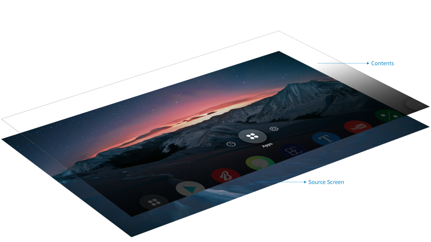
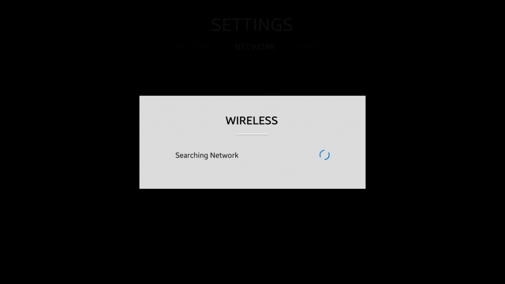
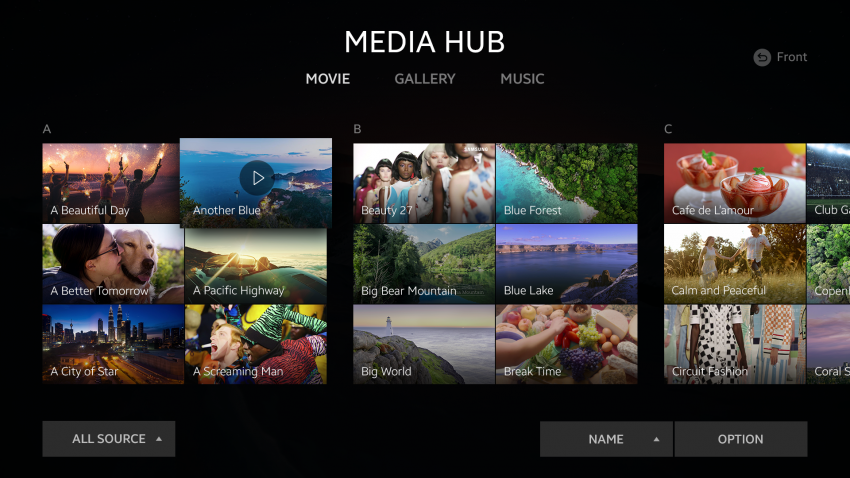
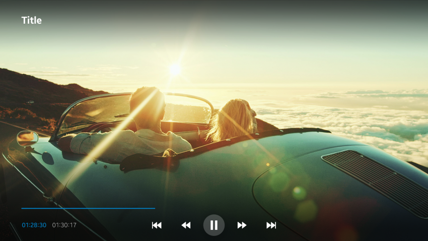

# App Structure

The structure of the Tizen 4.0 TV platform consists of layers which are used to display UI components and other items.

The following basic screens are included in the structure of the Tizen 4.0 TV platform:

- [Source screen](#source-screen)
- [Partial screen](#partial-screen)
- [Full screen](#full-screen)
- [Detail screen](#detail-screen)

## Source Screen

A source screen is the basic screen view. It is the base of every screen.

 
*Structure of the source screen*

## Partial Screen

A partial screen is a temporary view of the screen, such as the Home menu. It has no history and it cannot be shown with other partial screens at the same time.

 
*Partial screen example of a popup screen*

## Full Screen

A full screen is the main view of each application. It provides the way to access detailed content and can be switched with other full screens.

 
*Full screen example of a movie screen*

## Detail Screen

A detail screen is the lower depth of the full screen. It contains the detailed view of application content, such as movies, pictures, and songs.

 
*Detail screen example of a movie play screen*

