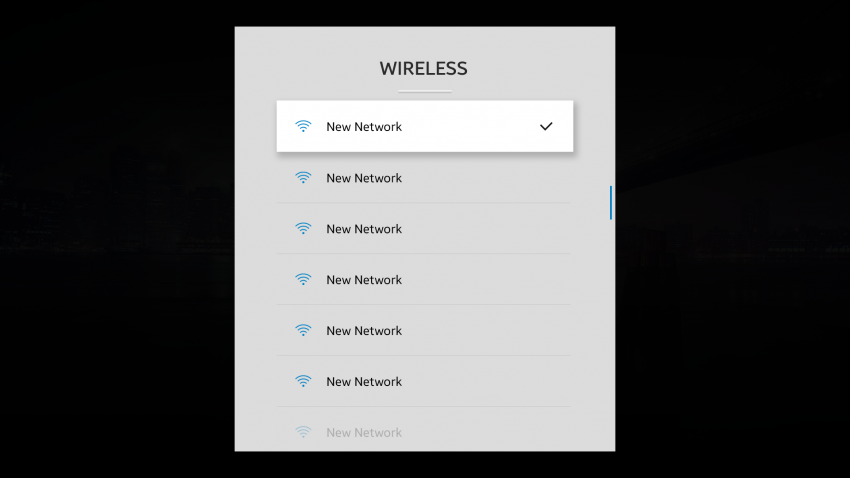
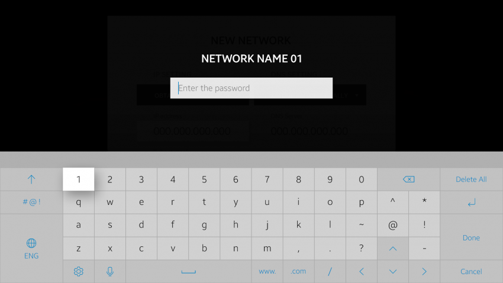
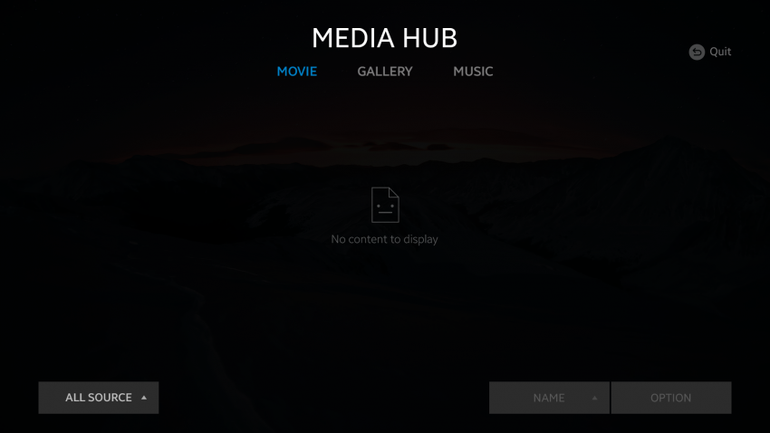
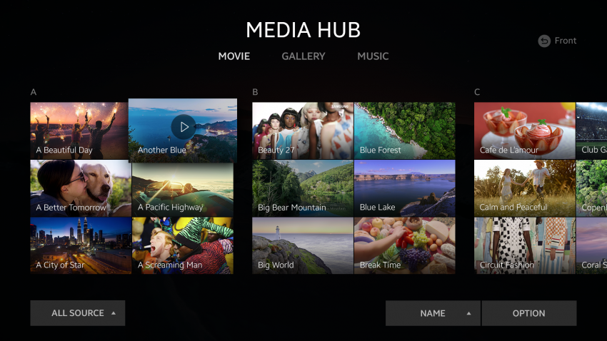

# Navigation

Navigation provides general instructions for interaction between various items, such as content and focus.

The following basic navigation options are available on the Tizen 4.0 TV platform:

-   [Back navigation](#back-navigation)
-   [Scrolling](#scrolling)
-   [Focusing](#focusing)
-   [Back key information](#back-key-information)

## Back Navigation

The user can return to the previous screen or state by using the remote control **Back** key.

The following guidelines apply to back navigation:

-   A quit popup appears when the user presses the **Back** key in the full screen layer.
-   The short and long presses of the **Back** key have different actions.

 
*Navigation using the Back key*

## Scrolling

The user can scroll the screen content when the whole content cannot be shown in the content area at the same time.

The following guidelines apply to scrolling:

- The header and footer areas are not scrolled.
- The scroll bar appears when the user scrolls the content.

 
*Scrolling through a sublist*

## Focusing

There is always a focus somewhere on the screen. The purpose of focusing is to concentrate on a specific item, which is important or likely to require actions.

 
*Focusing on the screen*

## Back Key Information

When the user presses the **Back** key on the remote control, there are 2 possible actions to be taken. Consequently, the **Back** key information shown on the screen must also provide the correct information based on the action possible on the current screen:

- Quit action: This information is shown when the focus is on the first item in the full screen. It means that a quit popup appears if the user presses the **Back** key.
- Front action: This information is shown when the focus is not on the first item in the full screen. It means that the focus moves to the first item if the user presses the **Back** key.

 
*Back key actions: Quit and Front*

