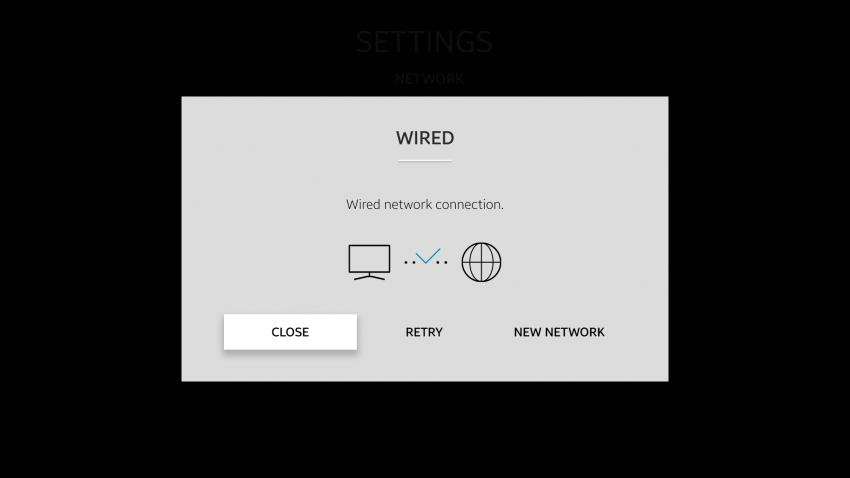

# Notifications

Notifications notify the user of new events, such as current states and confirmations.

A notification appears within an action popup or toast:

-   Notifications within an action popup require an immediate user decision. They provide information critical to the current screen.
-   Notifications within a toast do not require an immediate user decision. They are non-critical to the current screen.

 
*Action popup*

 
*Toast*
