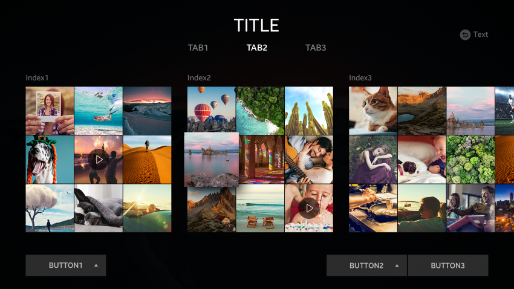
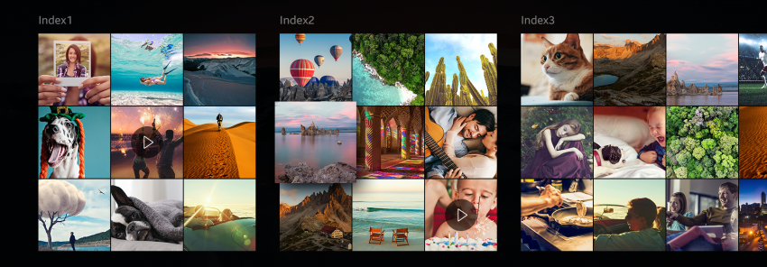
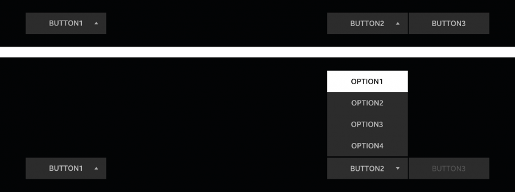

# Screen Layout

The TV screen is divided into the following 3 parts to help the user achieve desired goals:

-   [Header area](#header-area)
-   [Content area](#content-area)
-   [Footer area](#footer-area)

## Header Area

A header area is the top portion of the view. It provides information about the title of the current content and screen.

The following guidelines apply to the header area:

-   The header area can have tabs and a title bar.
-   The title bar is displayed above the tabs.

 
*Header area on the screen*

 
*Header area examples with and without tabs*

## Content Area

A content area provides the main information and content of the view.

The following guidelines apply to the content area:

-   The content area can be scrolled when the length of all content exceeds the size of the screen.
-   A focus at the screen edge is set in a fixed position when the length of all content exceeds the size of the screen.
-   The focus does not circulate between items in the content area.
-   A guide text appears when there is no content to display.

 
*Content area on the screen*

 
*Content area with Index*

## Footer Area

A footer area generally has buttons and drop-down menus. They help the user to extend actions and control content easily.

 
*Footer area on the screen*

 
*Footer with drop-down menus*

