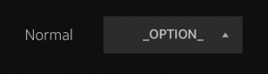
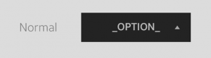
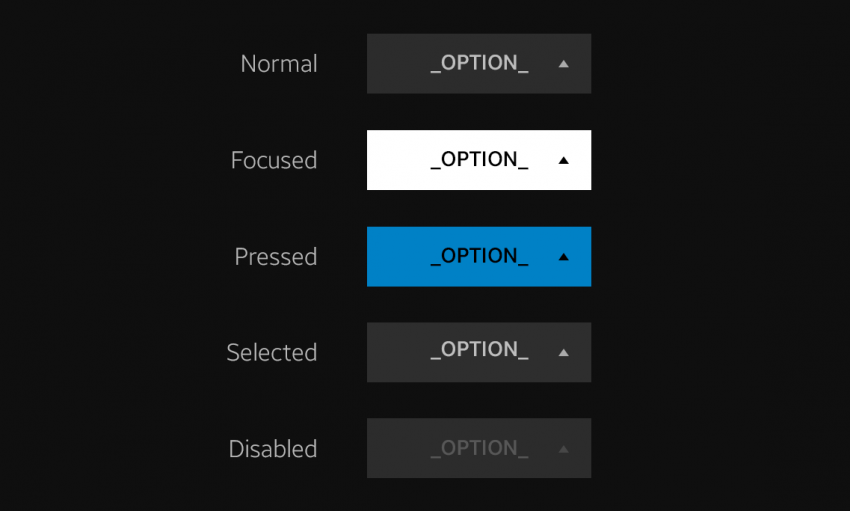

# Styles

Tizen TV applications use various styles to improve the clarity and usability of the information on the screen:

-   [Background color](#background-color)
-   [Theme](#theme)
-   [Color swatch](#color-swatch)
-   [Font style](#font-style)

## Background Color

The Tizen TV uses a dark color (RGB 0,0,0) as a fullscreen background. The color has some transparency (opacity 95%), to allow the user to see the current screen image through the dark color.

 
*Background color for fullscreen.*

## Theme

The UI components have 2 themes available: dark and light.

Each theme is used based on the background color. Since the background color is usually dark, the dark theme is mainly used. However, if the background is light, the light theme is applied.

|  |  |
|:---:|:---:|
| *Dark theme* | *Light theme* |

## Color Swatch

The Tizen TV uses clear and distinct colors to allow various item states (such as normal, focused, selected, and disabled) to be easily recognized.

| No. | Color | RGB / Opacity | Swatch | Components |
|:---:|:---:|:---:|:---:|:---:|
| 1 | Black | 0,0,0 / 95% |  | Background dim |
| 2 | White | 0, 0, 0 / 100% |  | Normal text |
| 3 | Grey | 220, 220, 220 / 100% |  | Popup |
| 4 | Blue | 0, 129, 198 / 100% |  | Selected color |

## Font Style

Different font styles are used to help the user easily recognize different states or importance levels of items. To ensure clear visibility, the style is determined based on the color background.

 
*Different font styles for different states.*

