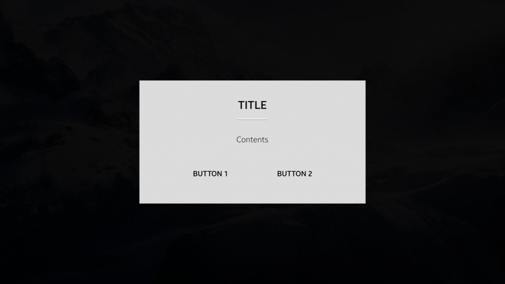

# Assist Views

Assist views provide additional information to the user.

The following UI components are assist views:

-   [Popup](#popup)
-   [Toast](#toast)
-   [Context popup](#context-popup)

## Popup

A popup allows the user to set and confirm a value, or asks them to make a decision immediately.

### Action Popup

Action popups consist of content, action buttons, and an optional title. An action popup appears at the center of the screen.

The following guidelines apply to action popups:

- When the action popup appears, the background screen is dimmed.
- The title is limited to 1 line of text.
- Content can include text, an icon, and additional items.
- The action popup has 2 action buttons, by default.

 
*Action popup*

### Function Popup

Function popups are used to change or set a value and to confirm the change at the same time. A function popup can appear at the left side or the bottom of screen. It consists of a slider and an optional title.

The following guideline applies to function popups:

- When the function popup appears, the background screen is not dimmed.

*Function popup at the bottom of the screen*

## Toast

Toasts are used to provide simple notifications. They cannot be controlled by the user. A toast contains only text, and it disappears after a few seconds.

 

*Toast notification*

## Context Popup

Context popups provide access to options related to a currently-selected item. A context popup appears as a list near the selected item.

A context popup item can be in either of the following states:

-   Normal
-   Focused
-   Selected
-   Disabled

 
*Context popup*

