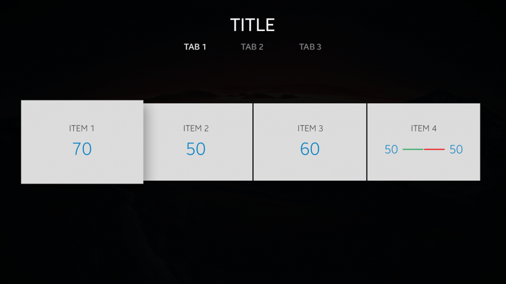
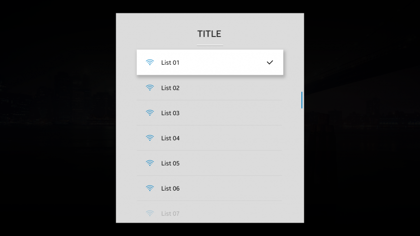
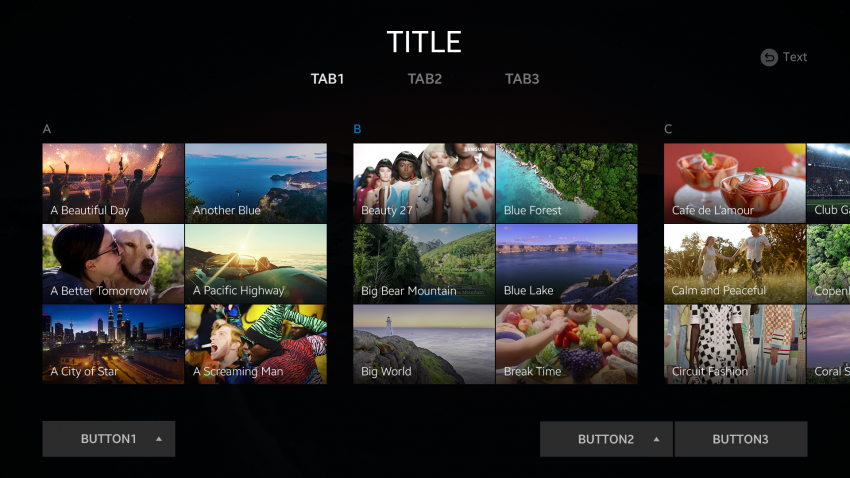

# Navigation Elements

Navigation elements allow the user to browse content and switch between screens.

The following UI components are navigation elements:

-   [Title bar](#title-bar)
-   [Tabs](#tabs)
-   [Scroll bar](#scroll-bar)
-   [Index](#index)

## Title Bar

The title bar is located at the top of the screen. It is generally centered, and can have tabs in addition to title text.

 
*The title bar can have tabs, if needed.*

 
*Basic title bar without tabs*

## Tabs

Tabs are used to categorize content into different groups. The user can switch between the groups by selecting the appropriate tab. Tabs are generally centered below the title bar and arranged horizontally. Each tab can also have an icon.

Tabs can be in either of the following states:

-   Normal
-   Focused
-   Selected
-   Disabled

The following guidelines apply to tabs:

-   1 of the tabs must always be focused or selected.
-   Tab content must be presented in a screen view that provides relevant information.
-   Each tab is equally important and has content at the same level.

 
*Tab bar*

 
*Title bar with tabs*

## Scroll Bar

When there is more content than can fit on the screen, a scroll bar provides an indicator of the amount of content and the current position in the content. When the content is focused, the scroll bar appears on the right or the bottom of the screen.

The scroll bar consists of a handler, which travels on a track. The handler shows the current position and allows the user to change which part of the content is visible.

The following guidelines apply to scroll bars:

-   The scroll bar is automatically hidden after 3 seconds.
-   The scroll direction is the same as the direction from which new content appears.
-   The handler has a length proportional to the amount of scrollable content.
-   The track length is at most the height or width of the screen.

 
*List with a scroll bar*

## Index

Indexes allow the user to easily access content within a category. Items in an index are arranged alphabetically.

An index can be either in the normal state or the focused state.

 
*Index items arranged alphabetically*
