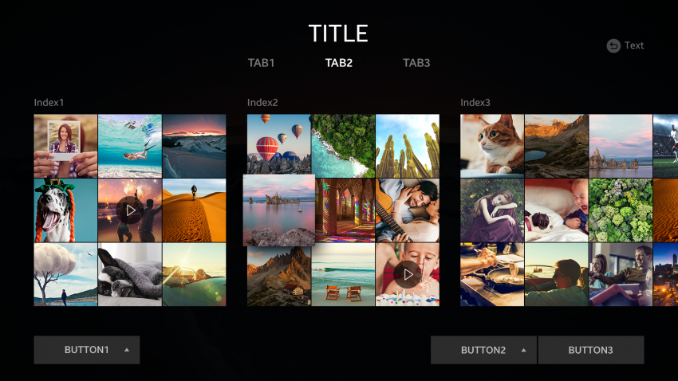
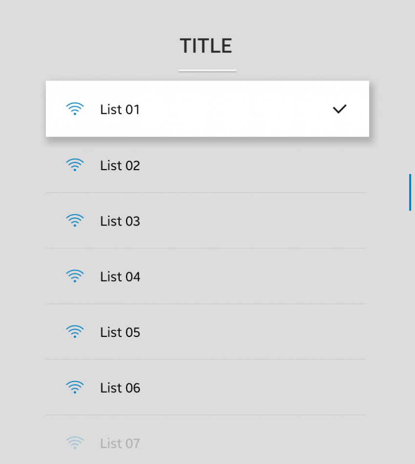

# Presentation Views

Presentation views display content in different ways.

The following UI components are presentation views:

-   [Grid view](#grid-view)
-   [List view](#list-view)
-   [Progress](#progress)

## Grid View

A grid view is used to display graphical content. It consists of grid items and optional labels. The grid items can optionally have additional information.

A grid item can be in either of the following states:

-   Normal
-   Focused
-   Selected
-   Disabled

The following guidelines apply to grid items:

-   The grid item displays only graphical items, such as icons and images.
-   If the label length exceeds the text area, the excess characters are replaced with an ellipsis (...).
-   If available, additional information is shown over the grid item.

 
*Grid view*

## List View

A list view is used to show multiple text-based items that belong to the same category.

A list item can be in either of the following states:

-   Normal
-   Focused
-   Selected
-   Disabled

The following guidelines apply to list items:

-   List items can contain a label, an icon, or both.
-   The label is limited to 1 line of text.
-   If the label length exceeds the text area, the excess characters are replaced with an ellipsis (...).

 
*List view*

## Progress

Progress components provide information about the current state of ongoing tasks.

### Activity Indicator

An activity indicator informs the user that a task is ongoing without specifying the progress rate. The indicator disappears when the task is completed.

<video controls height="440">
  <source src="media/tizen_4.0components_vi_2.3.2.activity_indicator.mp4" type=video/mp4>
</video>

*Activity indicator*

### Progress Indicator

A progress indicator is displayed as a bar.

There are 2 types of progress indicator:

- Definite progress indicator informs the user about the time remaining or progress percentage of the ongoing task.
- Indefinite progress indicator informs the user that a task is ongoing without specifying the progress rate.

<video controls width="784">
  <source src="media/tizen_4.0components_vi_2.3.1.1.progress_indicator.mp4" type=video/mp4>
</video>

 

<video controls width="784">
  <source src="media/tizen_4.0components_vi_2.3.1.2.uncertain_progress_indicator.mp4" type=video/mp4>
</video>

*Progress indicators*
