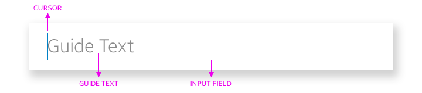
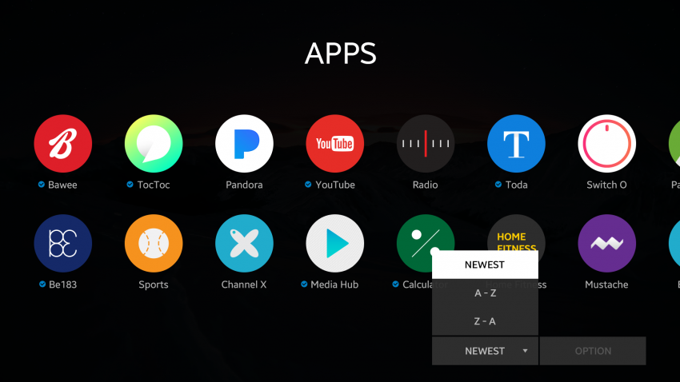
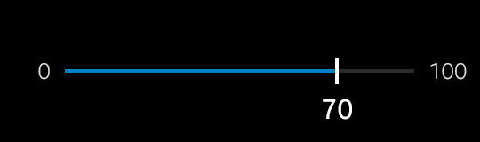
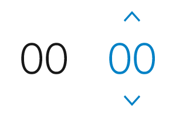
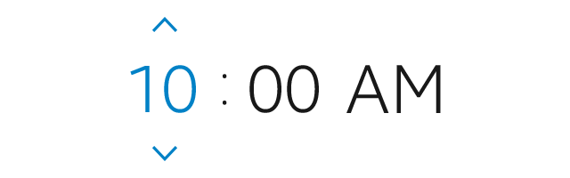

# User Input Elements

User input elements collect user input for specific tasks.

The following UI components are user input elements:

-   [Button](#button)
-   [Check](#check)
-   [Radio button](#radio-button)
-   [Text input](#text-input)
-   [Drop-down menu](#drop-down-menu)
-   [Slider](#slider)
-   [Picker](#picker)

## Button

Buttons are the most common way to interact with an application. A button can have a text label, an icon, or both.

A button can be in either of the following states:

-   Normal
-   Focused
-   Pressed
-   Disabled

*Button examples*

*Button states*

*Icon button states*

## Check

Check components allow the user to switch between 2 states, such as on and off, or selected and unselected.

### Check Box

Check boxes are used to select or confirm tasks. The check box can have a label. The check mark appears when the option is selected.

A check box can be in either of the following states:

- Unselected
- Selected
- Focused
- Disabled

*Unselected and selected check boxes*

### Toggle

Toggles are used to switch a feature on and off. The toggle can have a label.

A toggle can be in either of the following states:

- Unselected
- Selected
- Focused
- Disabled

*Unselected and selected toggles*

## Radio Button

Radio buttons are used when the user can select only 1 option from multiple options. A radio button can have a label. The radio mark appears when the option is selected.

A radio button can be in either of the following states:

- Unselected
- Selected
- Focused
- Disabled

The following guidelines apply to radio buttons:

- When 1 option is selected, the other options are automatically unselected.
- The label is always located to the right of the radio button.

*Unselected and selected radio buttons*

## Text Input

Text input components allow the user to enter text. A text input consists of an input field and a cursor. It can also contain guide text, which describes the purpose of the input field or provides example input.

The following guidelines apply to guide text:

-   If the text input field has no label, use a noun form for the guide text.
-   If the text input field has a label, use the guide text to present example input in the expected format.
-   If it is not possible to provide an input example, do not use guide text.
-   The guide text disappears when the user enters text into the input field.

*Parts of a text input component*

## Drop-down Menu

Drop-down menus allow the user to select 1 option from a list of multiple options within a drop-down popup. A drop-down menu consists of a drop-down button and a drop-down popup. When the user selects the button, the popup appears.

Drop-down menus can indicate the selected option in 2 ways:

- The selected option is marked within the drop-down popup.
- The selected option is shown as the label on the drop-down button.

A drop-down button or popup option can be in either of the following states:

- Normal
- Focused
- Selected
- Disabled

The following guidelines apply to drop-down menus:

- The drop-down menu must provide a default selected option.
- A check mark can appear on the selected option in the popup.

*Drop-down menu with selected option as label*

## Slider

Sliders are used to adjust a value within a certain range. A slider is displayed as a bar, which consists of a track and values. It can also have a handler, additional text, and an icon, if necessary.

A slider can be in either of the following states:

-   Normal
-   Focused
-   Disabled

*Slider*

## Picker

Pickers allow the user to change or select a value. They are also used to change or select multiple values separately.

### Number Picker

Number pickers are used to change or select number values. A number picker consists of the value and setting indicators, which allow the user to increase or decrease the value. The setting indicators appear when the number picker is activated.

A number picker can be in either of the following states:

- Normal
- Focused
- Activated
- Disabled

*Number picker*

### Date&Time Picker

Date&time pickers are used to set date or time values, and they are displayed as a group of pickers.

There are 2 types of date&time pickers:

- The date picker is used to set date values. It consists of a day, a month, and a year picker.
- The time picker is used to set time values. It consists of an hour, a minute, and an am/pm picker (only in 12-hour format).

*Date picker*

*Time picker*

A date&time picker can be in either of the following states:

- Normal
- Focused
- Activated
- Disabled
