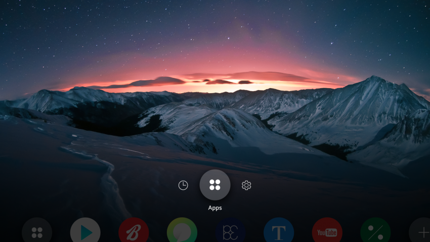
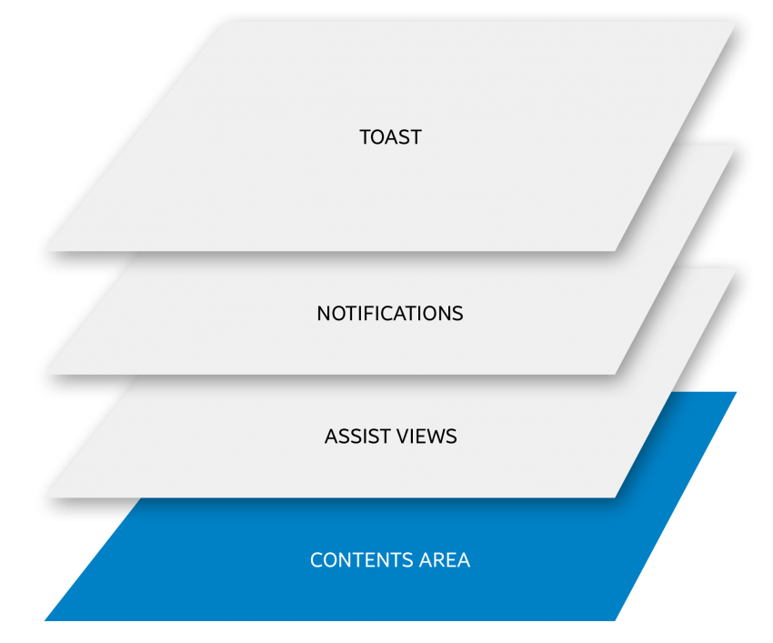
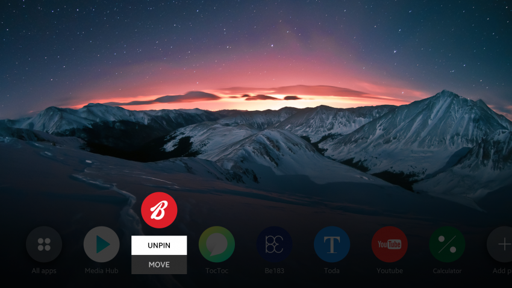
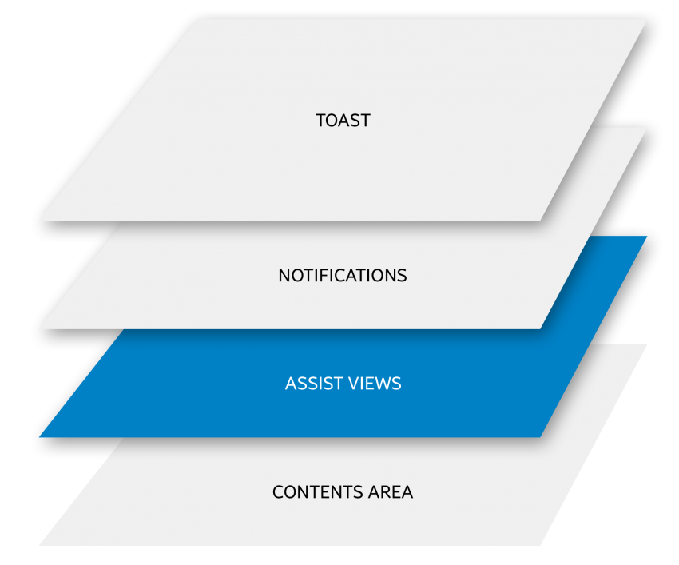
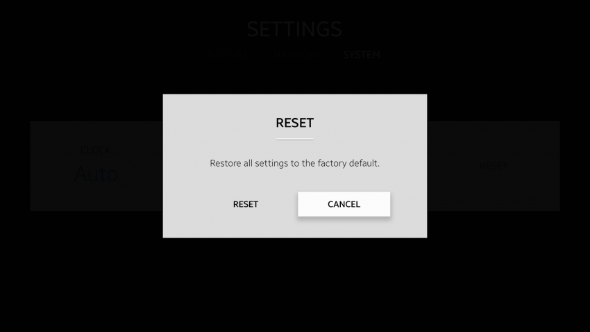
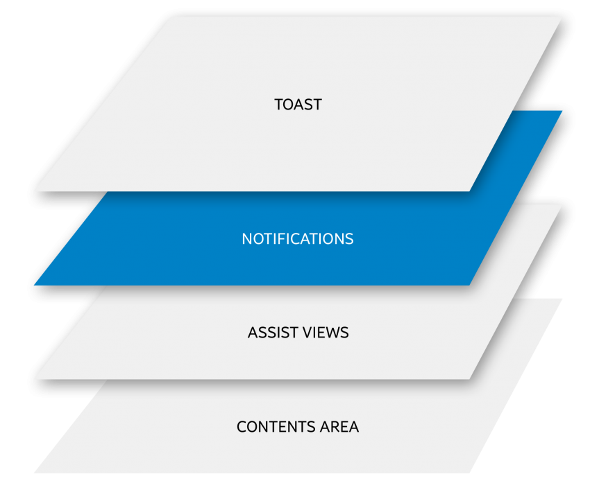
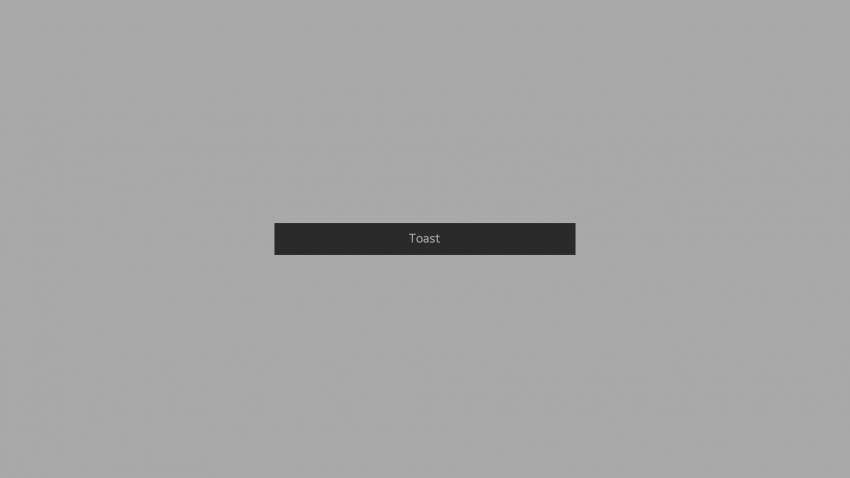
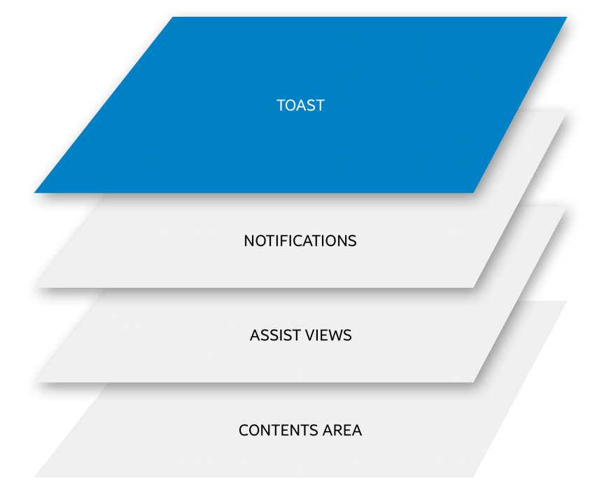

# App Layer

The Tizen 4.0 TV platform has layers, which are used to display UI components.

The following application layers are used in the Tizen 4.0 TV platform:

-   [Content area](#content-area)
-   [Assist view](#assist-view)
-   [Notification](#notification)
-   [Toast](#toast)

## Content Area

A content area is the basic screen providing the application view. It displays UI components and items used in every application.

 
*Content area example*

The content area is the lowest layer in the layer hierarchy.

 
*Content area layer*

## Assist View

An assist view provides a popup which is not a notification or a context popup.

 
*Assist view example*

Since the assist view layer is above the content area layer, the user cannot control any items in the content area while the assist view is shown.

 
*Assist view layer*

## Notification

A notification provides important information for the user within a popup. The user must confirm the notification immediately.

 
*Notification example*

The notification layer is located above the assist view layer. This means that the user cannot control any items in the assist view or content area while the notification is shown.

 
*Notification layer*

## Toast

A toast displays simple messages about new events, such as current states or confirmations.

 
*Toast example*

The toast is the topmost layer in the layer hierarchy. However, the user can control items in the lower layers while the toast is shown.

 
*Toast layer*
