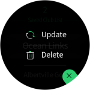
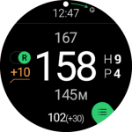

# Create a lasting impression with your designs

Communicate the identity and purpose of your app by carefully designing visual elements such as colors, icons, and typography. Test your app to see if you can read information easily and find a consistent brand identity. You should also make sure that your app uses consistent animations when transitioning between screens or performing functions. Design elements with strong visual impact, like the launch screen or icons, to work well with the Gear's circular display.

## Examples

-   **KLM**

    KLM lets users reserve flights and check their booking. It uses the company's blue brand color and white in a balanced and consistent way. The KLM logo appears consistently at the top, and the company's unique font expresses the brand identity.

         
    *The use of KLM's blue brand color communicates a clear brand identity.*

-   **GolfNavi**

    GolfNavi offers a comprehensive golf solution. Used against a dark background, the green theme color enhances readability when outdoors and expresses a strong brand image. Consistent iconography and animation helps to make this app visually attractive.

          
    *Consistent use of color emphasizes the app's brand identity.*

-   **Gear Places**

    Gear Places recommends places to visit. It increases the color contrast of content and delivers a strong brand experience by using a vivid background color throughout.

          
    *Variations of a single color expresses a consistent brand identity.*

## Things to check

-   What are the visual elements that come to mind when you think of your app's name?
-   Are there any visual elements or styles that deviate from the Gear guidelines? Refer to [Visual design](../visual-design.md) for more details.
