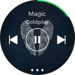

# Help users find their way

The Gear's small display can and should display a limited amount of content. It should use a clear information hierarchy so users can understand which information is critical and which is supplementary.

## Examples

-   **News Briefing**

    News Briefing curates news from user-designated categories into a list. In a detailed news page, content is loaded smoothly within the same page, reducing the navigation depth for a seamless experience.

          
    *The image, title, and text are provided in order for simple navigation.*

-   **Spotify**

    Spotify lists music in a simple structure, allowing users to navigate playlists intuitively. The bottom button on each screen takes the user immediately to the song that's currently playing.

         
    *The fixed button at the bottom takes users to the currently playing song.*

## Things to check

-   Can users explore your app easily?
-   Is there any inconsistency in your navigation flow that deviates from the Gear guidelines?
-   Does your app provide visual cues for what to do and where to tap?
