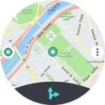
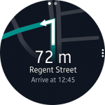

# Improve the user experience through the Gear's diverse interactions

The range of diverse interactions on the Gear gives you the opportunity to create a smooth user experience by providing feedback on user input and designing predictable interactions.

## Examples

-   **HERE WeGo**

    HERE WeGo shows maps and journey directions. Users can search for addresses with voice, zoom in and out of the map with the bezel, and explore the map with swipes.

           
    *Users can search with voice and zoom in/out of the map with the bezel.*

-   **Yelp**

    Yelp helps people find the best local businesses . It suggests nearby stores or restaurants based on the user's current location. Users can interact with the app in diverse ways through the rotary action, touch, and swiping. Voice input can also be made when they double tap the screen.

         
    *Users search for restaurants using their voice, and explore menus with the bezel.*

-   **Voxer**

    Voxer sends voice messages. Users can select a contact, hold down the recorder icon to record their message, and send it instantly.

          
    *Users touch and hold the recorder icon to record and send a message.*

## Things to check

-   Can you create more intimate user interactions through haptic and sound feedback, in addition to visual?
