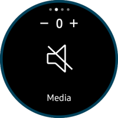
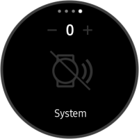
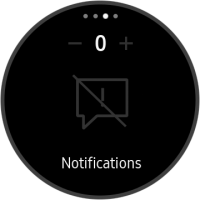
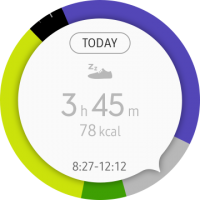
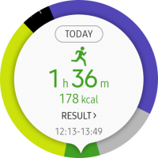
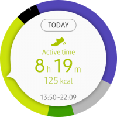
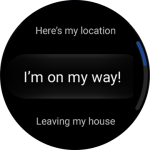

# Provide a precise and unique control with the bezel

The bezel precisely controls components without users obscuring the display with their hand or finger. Turning the bezel is a familiar action to users, so draw upon that familiarity to find ways to use the bezel for more tasks.

## Examples

-   **Volume setting**

    Volume pages allow users to adjust volume. Users can navigate through categories by swiping, and adjust volume levels precisely with the rotary action.

        
    *Users control the volume with the rotary action.*

-   **Samsung Health**

    Samsung Health shows the user's daily activities. A 24-hour pie chart is divided into certain activity duration with colored sections. The rotary action brings up detailed records of each activity.

        
    *Users rotate the bezel to view their daily activity.*

-   **Glympse**

    Glympse shares the user's real-time location and sends a message to friends. When sharing where they are, users can use the rotary action to adjust the timer (designed after the Glympse logo) or select one of the preset messages.

         
    *Users can rotate the bezel to adjust the G-shaped timer or select a message to send.*

-   **Gear for Nest**

    Gear for Nest controls the thermostat by syncing with a Nest product. Users don't need to learn how to interact with the app, as they can adjust the temperature by rotating the bezel just like they turn the Nest Learning Thermostat.

         
    *Users rotate the bezel just like they turn the Nest thermostat to adjust temperature.*

## Things to check

-   What kinds of content can be complemented with a rotary action?
-   Turning the bezel clockwise increases values, and turning it counterclockwise decreases values. Does your app align with these basic interaction principles?
-   How can your app create a unique experience by incorporating rotary action?
